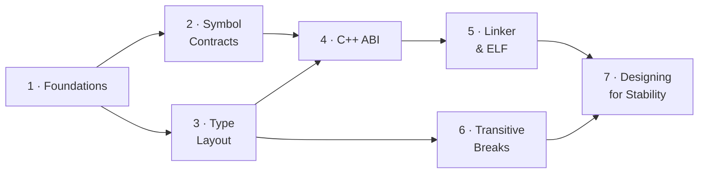

# ABI/API Handling — A Learning Series

This is the **conceptual hub** for understanding ABI/API compatibility — written
to *teach* the subject, not just catalog it. It is the front door to a seven-part
**learning series** that starts from first principles ("what is a symbol? what
does the loader do?") and builds up to the design patterns that keep a C/C++
shared library compatible across releases.

The series is for **two audiences at once**: developers who maintain or consume
shared libraries, and AI agents reasoning about whether a change is safe to ship.
Every break is explained as a *mechanism* — what the compiler baked in, what the
loader does, what byte moves — and then as a *fix*. abicheck's verdicts and
change kinds are woven in throughout, so the same page that teaches you *why* a
struct-field insertion corrupts memory also tells you what abicheck will report
when it sees one.

> **Looking for something faster?** For a 2-minute scannable card, see the
> [ABI Cheat Sheet](abi-cheat-sheet.md). For per-case runnable reproductions with
> code and a real failure demo, see the
> [Examples & Case Encyclopedia](../examples/index.md). For verdict semantics and
> CI exit codes, see [Verdicts](verdicts.md).

---

## How to read this series

The seven parts are ordered. If you're new to ABI compatibility, read them in
sequence — each builds on the mental models established by the last. If you're
here for a specific problem, jump straight to the relevant part.

| Part | Page | What it covers | Read it when… |
|------|------|----------------|---------------|
| **1** | [Foundations](abi-series/01-foundations.md) | Source → object → link → load; what a symbol is; API vs ABI | …you want the ground-up mental model (start here) |
| **2** | [Symbol Contracts](abi-series/02-symbol-contracts.md) | Removal, rename, signature, pointer-level, globals | …a symbol disappeared or changed meaning |
| **3** | [Type Layout](abi-series/03-type-layout.md) | Struct size/offset, alignment, enums, unions, bitfields | …you changed a struct, enum, or union |
| **4** | [C++ ABI](abi-series/04-cpp-abi.md) | Vtables, mangling, templates, `noexcept`, trivial→non-trivial, bases | …you maintain a C++ library |
| **5** | [Linker & ELF](abi-series/05-linker-elf.md) | SONAME, visibility, versioning, calling conv., TLS, security metadata | …a load-time/linker contract changed |
| **6** | [Transitive Breaks](abi-series/06-transitive-breaks.md) | Dependency leaks, anonymous structs, type-kind swaps, reserved fields | …the symbol table looks identical but consumers still break |
| **7** | [Designing for Stability](abi-series/07-designing-for-stability.md) | Opaque handles, Pimpl, version scripts, CI gating — with full code | …you're designing an API to evolve safely |

---

## Break families at a glance

Every detected change maps to one of these families. The verdict column shows the
typical classification; the exact verdict per fixture lives in
`examples/ground_truth.json` and the [Examples Encyclopedia](../examples/index.md).
The **Part** column points to where the mechanism is explained.

| Family | Representative cases | Typical verdict | Explained in |
|--------|---------------------|-----------------|--------------|
| Symbol/function removal & rename | 01, 12, 58, 66 | 🔴 BREAKING | [Part 2](abi-series/02-symbol-contracts.md) |
| Signature changes (params, return, pointer level) | 02, 10, 33, 46 | 🔴 BREAKING | [Part 2](abi-series/02-symbol-contracts.md) |
| Global variable type/qualifier/removal | 11, 39, 58 | 🔴 BREAKING | [Part 2](abi-series/02-symbol-contracts.md) |
| Struct/class layout, alignment & packing | 07, 14, 40, 42, 43, 56, 117 | 🔴 BREAKING | [Part 3](abi-series/03-type-layout.md) |
| Enum value/underlying changes | 08, 19, 20, 57 | 🔴 BREAKING | [Part 3](abi-series/03-type-layout.md) |
| Union layout | 24, 26 (grows) · 26b (no growth) | 🔴 / 🟢 | [Part 3](abi-series/03-type-layout.md) |
| C++ vtable & virtual methods | 09, 23, 38, 68, 72 | 🔴 BREAKING | [Part 4](abi-series/04-cpp-abi.md) |
| C++ qualifiers, mangling & ABI tags | 21, 22, 30, 71, 86, 101, 113 | 🔴 / 🟠 | [Part 4](abi-series/04-cpp-abi.md) |
| Trivial → non-trivial (calling convention) | 64, 69 | 🔴 BREAKING | [Part 4](abi-series/04-cpp-abi.md) |
| Templates, inline & ODR | 16, 17, 47, 59, 79, 85, 87 | 🔴 / 🟢 | [Part 4](abi-series/04-cpp-abi.md) |
| Modern C/C++ contract shifts (char8_t, _BitInt, _Atomic, concepts) | 105, 114, 115, 116 | 🔴 / 🟢 | [Part 4](abi-series/04-cpp-abi.md) |
| ELF/linker metadata (SONAME, visibility, versioning, RPATH, TLS) | 05, 06, 13, 49, 51, 52, 65, 67 | 🔴 / 🟢 | [Part 5](abi-series/05-linker-elf.md) |
| Transitive/dependency & `detail::` leaks | 18, 48, 74–77, 80, 97, 104, 112 | 🔴 BREAKING | [Part 6](abi-series/06-transitive-breaks.md) |
| Source-only / API-level (rename, access, explicit) | 31, 34, 96, 106 | 🟠 API_BREAK | [Parts 4](abi-series/04-cpp-abi.md) & [6](abi-series/06-transitive-breaks.md) |
| Deployment risk (noexcept, ISA dispatch, version-require) | 15, 83 | 🟡 COMPATIBLE_WITH_RISK | [Part 4](abi-series/04-cpp-abi.md) |
| Compatible additions & quality signals | 03, 25, 26b, 27, 29, 61, 62, 99 | 🟢 COMPATIBLE | [Part 7](abi-series/07-designing-for-stability.md) |
| Scoped/non-public internal changes | 118, 119, 120 | ✅ NO_CHANGE | [Part 6](abi-series/06-transitive-breaks.md) |

---

## The one idea to carry through all seven parts

If you remember nothing else:

> **The compiler bakes the library's ABI facts — sizes, offsets, register
> choices, vtable slot numbers, symbol names — into every caller, as immediate
> constants, and never re-checks them.** When the library changes one of those
> facts in a later release, the old caller keeps using the old number. Nobody
> re-validates it. That is why an ABI break is *silent*: no linker error, often
> no crash, just wrong bytes at the wrong address.
>
> Every fix in [Part 7](abi-series/07-designing-for-stability.md) is therefore a
> variation on a single move: **stop publishing the fact** — hide it behind a
> pointer, a version node, or hidden visibility — so you stay free to change it.

abicheck exists to catch these breaks *before* they ship: it dumps a snapshot of
each binary, diffs them structurally, and classifies every difference into one of
five verdicts mapped to CI exit codes. See
[Part 1 §7](abi-series/01-foundations.md#7-where-abicheck-fits) for how that
pipeline works, and [Verdicts](verdicts.md) for the exit-code semantics.

---

## Detection coverage and roadmap

abicheck detects **190 change kinds** today (see the
[Change Kind Reference](../reference/change-kinds.md)), spanning every family in
the table above — including the calling-convention, alignment/packing, bit-field,
dual-ABI (`_GLIBCXX_USE_CXX11_ABI`), ABI-tag, `char8_t`, `_BitInt`, `_Atomic`,
and CPU-dispatch cases. Areas still deepening: richer cross-compiler ABI-drift
modelling (GCC vs Clang vs MSVC for the same headers) and LTO/visibility
interactions where an inlined symbol disappears. The authoritative, always-current
taxonomy is the generated [Change Kind Reference](../reference/change-kinds.md)
and [Examples Encyclopedia](../examples/index.md).

---

➡️ **Start the series: [Part 1 — Foundations](abi-series/01-foundations.md)**
