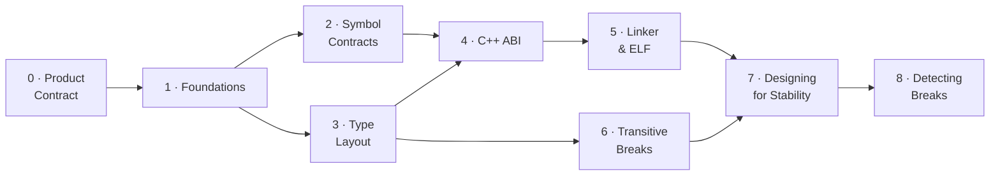

# ABI/API Handling — A Learning Series

This is the **conceptual hub** for understanding ABI/API compatibility — written
to *teach* the subject, not just catalog it. It is the front door to a nine-part
**learning series** that starts from first principles ("what is a symbol? what
does the loader do?") and builds up to the design patterns that keep a C/C++
shared library compatible across releases.

The series is for **two audiences at once**: developers who maintain or consume
shared libraries, and AI agents reasoning about whether a change is safe to ship.
Every break is explained as a *mechanism* — what the compiler baked in, what the
loader does, what byte moves — and then as a *fix*. abicheck's verdicts and
change kinds are woven in throughout, so the same page that teaches you *why* a
struct-field insertion corrupts memory also tells you what abicheck will report
when it sees one.

> **Looking for something faster?** For a 2-minute scannable card, see the
> [ABI Cheat Sheet](abi-cheat-sheet.md). For per-case runnable reproductions with
> code and a real failure demo, see the
> [Examples & Case Encyclopedia](../examples/index.md). For verdict semantics and
> CI exit codes, see [Verdicts](verdicts.md). For unfamiliar terms (SONAME,
> vtable, IFUNC, install name, TLS model…), see the
> [Glossary](abi-series/glossary.md).

!!! note "Scope & assumptions"
    - **Examples are mostly ELF/Linux and Itanium-C++-ABI flavored** unless a
      section says otherwise. PE/COFF (Windows) and Mach-O (macOS) have their own
      loader, export, and versioning rules — see the per-platform parallels in
      [Part 5](abi-series/05-linker-elf.md#pecoff-and-mach-o-parallels) and the
      [Platform Support reference](../reference/platforms.md). For example, the
      "lookup by name" model in Part 2 is exact for ELF and for most C/C++
      exports, but **Windows DLLs can also export/import by ordinal**, where the
      contract is a *number*, not a name.
    - **Detectability depends on the inputs you give abicheck** — symbols only,
      DWARF/PDB debug info, or public headers. Some changes (e.g. `#define`
      macros, inline/template *bodies*, uninstantiated templates) are invisible
      to *any* artifact comparison. See the per-change matrix in
      [Limitations](limitations.md#source-only-changes-invisible-to-binaryobject-analysis).

---

## How to read this series

The parts are ordered. If you're new to ABI compatibility, read them in
sequence — each builds on the mental models established by the last. If you're
here for a specific problem, jump straight to the relevant part.

| Part | Page | What it covers | Read it when… |
|------|------|----------------|---------------|
| **0** | [Compatibility as a Product Contract](abi-series/00-product-contract.md) | Public surface, SemVer mapping, contract shapes — the *framing* | …before anything else: a change is only a "break" if it breaks a promise |
| **1** | [Foundations](abi-series/01-foundations.md) | Source → object → link → load; what a symbol is; API vs ABI | …you want the ground-up mental model (start here) |
| **2** | [Symbol Contracts](abi-series/02-symbol-contracts.md) | Removal, rename, signature, pointer-level, globals | …a symbol disappeared or changed meaning |
| **3** | [Type Layout](abi-series/03-type-layout.md) | Struct size/offset, alignment, enums, unions, bitfields | …you changed a struct, enum, or union |
| **4** | [C++ ABI](abi-series/04-cpp-abi.md) | Vtables, mangling, templates, `noexcept`, trivial→non-trivial, bases | …you maintain a C++ library |
| **5** | [Linker & ELF](abi-series/05-linker-elf.md) | SONAME, visibility, versioning, calling conv., TLS, security metadata | …a load-time/linker contract changed |
| **6** | [Transitive Breaks](abi-series/06-transitive-breaks.md) | Dependency leaks, anonymous structs, type-kind swaps, reserved fields | …the symbol table looks identical but consumers still break |
| **7** | [Designing for Stability](abi-series/07-designing-for-stability.md) | Opaque handles, Pimpl, version scripts, CI gating — with full code | …you're designing an API to evolve safely |
| **8** | [Detecting Breaks](abi-series/08-detection.md) | Tracking approaches, evidence each break family needs, why single-method checkers miss whole families | …you're deciding *how* to catch all of the above in CI |



> **Cross-cutting companion:** [Evidence & Detectability](evidence-and-detectability.md)
> explains *which inputs* (symbols, debug info, headers, app, bundle) let a tool
> see a given change at all — read it alongside any part when you're wondering
> "why did the tool catch this but not that?"

## Pick a reading path for your role

The series is ordered, but you rarely need all of it at once. These paths get
each audience to the pages that matter for them fastest:

| Audience | Recommended path |
|----------|------------------|
| **New C/C++ library author** | [Product Contract](abi-series/00-product-contract.md) → [Foundations](abi-series/01-foundations.md) → [Symbol Contracts](abi-series/02-symbol-contracts.md) → [Type Layout](abi-series/03-type-layout.md) → [Designing for Stability](abi-series/07-designing-for-stability.md) |
| **C++ library maintainer** | [Foundations](abi-series/01-foundations.md) → [C++ ABI](abi-series/04-cpp-abi.md) → [Type Layout](abi-series/03-type-layout.md) → [Transitive Breaks](abi-series/06-transitive-breaks.md) → [Designing for Stability](abi-series/07-designing-for-stability.md) |
| **CI / release engineer** | [Product Contract](abi-series/00-product-contract.md) → [Detecting Breaks](abi-series/08-detection.md) → [Tool Comparison](../reference/tool-comparison.md) → [Policy Profiles](../user-guide/policies.md) → [Baselines](../user-guide/baseline-management.md) → [Exit Codes](../reference/exit-codes.md) → [Output Formats](../user-guide/output-formats.md) |
| **Distribution / package maintainer** | [Linker & ELF](abi-series/05-linker-elf.md) → [Transitive Breaks](abi-series/06-transitive-breaks.md) → [Multi-Binary Releases](../user-guide/multi-binary.md) → [Application Compatibility](../user-guide/appcompat.md) |
| **Plugin / SDK author** | [Symbol Contracts](abi-series/02-symbol-contracts.md) → [Plugin Systems](../user-guide/plugin-systems.md) → [Policy Profiles](../user-guide/policies.md) → [Product Contract §4](abi-series/00-product-contract.md#4-name-your-contract-shape) |
| **AI agent / automated reviewer** | [Overview](abi-api-handling.md) → [Evidence & Detectability](evidence-and-detectability.md) → [Examples Encyclopedia](../examples/index.md) → [Change Kind Reference](../reference/change-kinds.md) |

---

## Break families at a glance

Every detected change maps to one of these families. The verdict column shows the
typical classification; the exact verdict per fixture lives in
`examples/ground_truth.json` and the [Examples Encyclopedia](../examples/index.md).
The **Part** column points to where the mechanism is explained.

Case numbers link straight to the generated example page; the **Typical verdict**
column says "mixed" where the verdict is case-dependent (the per-fixture verdict
is the source of truth).

| Family | Representative cases | Typical verdict | Explained in |
|--------|---------------------|-----------------|--------------|
| Symbol/function removal & rename | [01](../examples/case01_symbol_removal.md), [12](../examples/case12_function_removed.md), [58](../examples/case58_var_removed.md), [66](../examples/case66_language_linkage_changed.md) | 🔴 BREAKING | [Part 2](abi-series/02-symbol-contracts.md) |
| Signature changes (params, return, pointer level) | [02](../examples/case02_param_type_change.md), [10](../examples/case10_return_type.md), [33](../examples/case33_pointer_level.md), [46](../examples/case46_pointer_chain_type_change.md) | 🔴 BREAKING | [Part 2](abi-series/02-symbol-contracts.md) |
| Global variable type/qualifier/removal | [11](../examples/case11_global_var_type.md), [39](../examples/case39_var_const.md), [58](../examples/case58_var_removed.md) | 🔴 BREAKING | [Part 2](abi-series/02-symbol-contracts.md) |
| Struct/class layout, alignment & packing | [07](../examples/case07_struct_layout.md), [14](../examples/case14_cpp_class_size.md), [40](../examples/case40_field_layout.md), [42](../examples/case42_type_alignment_changed.md), [43](../examples/case43_base_class_member_added.md), [56](../examples/case56_struct_packing_changed.md), [117](../examples/case117_no_unique_address.md) | 🔴 BREAKING | [Part 3](abi-series/03-type-layout.md) |
| Enum value/underlying changes | [08](../examples/case08_enum_value_change.md), [19](../examples/case19_enum_member_removed.md), [20](../examples/case20_enum_member_value_changed.md), [57](../examples/case57_enum_underlying_size_changed.md) | 🔴 BREAKING | [Part 3](abi-series/03-type-layout.md) |
| Union layout | [24](../examples/case24_union_field_removed.md), [26](../examples/case26_union_field_added.md) (grows) · [26b](../examples/case26b_union_field_added_compatible.md) (no growth) | mixed — 🔴 if size grows, else 🟢 | [Part 3](abi-series/03-type-layout.md) |
| C++ vtable & virtual methods | [09](../examples/case09_cpp_vtable.md), [23](../examples/case23_pure_virtual_added.md), [38](../examples/case38_virtual_methods.md), [68](../examples/case68_virtual_method_added.md), [72](../examples/case72_covariant_return_changed.md) | 🔴 BREAKING | [Part 4](abi-series/04-cpp-abi.md) |
| C++ qualifiers, mangling & ABI tags | [21](../examples/case21_method_became_static.md), [22](../examples/case22_method_const_changed.md), [30](../examples/case30_field_qualifiers.md), [71](../examples/case71_inline_namespace_moved.md), [86](../examples/case86_tag_struct_renamed.md), [101](../examples/case101_inline_namespace_version_bumped.md), [113](../examples/case113_abi_tag_changed.md) | mixed — 🔴 BREAKING or 🟠 API_BREAK | [Part 4](abi-series/04-cpp-abi.md) |
| Trivial → non-trivial (calling convention) | [64](../examples/case64_calling_convention_changed.md), [69](../examples/case69_trivial_to_nontrivial.md) | 🔴 BREAKING | [Part 4](abi-series/04-cpp-abi.md) |
| Templates, inline & ODR | [16](../examples/case16_inline_to_non_inline.md), [17](../examples/case17_template_abi.md), [47](../examples/case47_inline_to_outlined.md), [59](../examples/case59_func_became_inline.md), [79](../examples/case79_missing_template_instantiation.md), [85](../examples/case85_internal_template_signature_changed.md), [87](../examples/case87_default_template_arg_changed.md) | mixed — 🔴 BREAKING or 🟢 COMPATIBLE | [Part 4](abi-series/04-cpp-abi.md) |
| Modern C/C++ contract shifts (char8_t, _BitInt, _Atomic, concepts) | [105](../examples/case105_concept_tightening.md), [114](../examples/case114_char8t_migration.md), [115](../examples/case115_bit_int_width_changed.md), [116](../examples/case116_atomic_qualifier_changed.md) | mixed — 🔴 BREAKING or 🟢 COMPATIBLE | [Part 4 §Modern](abi-series/04-cpp-abi.md#modern-cc-and-toolchain-abi-hazards) |
| ELF/linker metadata (SONAME, visibility, versioning, RPATH, TLS) | [05](../examples/case05_soname.md), [06](../examples/case06_visibility.md), [13](../examples/case13_symbol_versioning.md), [49](../examples/case49_executable_stack.md), [51](../examples/case51_protected_visibility.md), [52](../examples/case52_rpath_leak.md), [65](../examples/case65_symbol_version_removed.md), [67](../examples/case67_tls_var_size_changed.md) | mixed — 🔴 BREAKING or 🟢 COMPATIBLE | [Part 5](abi-series/05-linker-elf.md) |
| Transitive/dependency & `detail::` leaks | [18](../examples/case18_dependency_leak.md), [48](../examples/case48_leaf_struct_through_pointer.md), [74](../examples/case74_detail_base_class_changed.md), [75](../examples/case75_detail_embedded_by_value.md), [76](../examples/case76_detail_pimpl_vtable_changed.md), [77](../examples/case77_detail_templated_base_changed.md), [80](../examples/case80_pimpl_shared_to_unique.md), [97](../examples/case97_api_depends_on_consumer_env.md), [104](../examples/case104_glibcxx_dual_abi_flip.md), [112](../examples/case112_lp64_ilp64.md) | 🔴 BREAKING | [Part 6](abi-series/06-transitive-breaks.md) |
| Source-only / API-level (rename, access, explicit, default args, hidden friends) | [31](../examples/case31_enum_rename.md), [34](../examples/case34_access_level.md), [96](../examples/case96_hidden_friend_removed.md), [106](../examples/case106_ctor_became_explicit.md), [123](../examples/case123_default_argument_removed.md), [124](../examples/case124_header_constant_value_changed.md) | 🟠 API_BREAK | [Part 6 §Source-only API breaks](abi-series/06-transitive-breaks.md#source-only-api-breaks-binary-identical) |
| Deployment risk (noexcept, ISA dispatch, version-require) | [15](../examples/case15_noexcept_change.md), [83](../examples/case83_cpu_dispatch_isa_dropped.md) | 🟡 COMPATIBLE_WITH_RISK | [Part 4](abi-series/04-cpp-abi.md) |
| Compatible additions & quality signals | [03](../examples/case03_compat_addition.md), [25](../examples/case25_enum_member_added.md), [26b](../examples/case26b_union_field_added_compatible.md), [27](../examples/case27_symbol_binding_weakened.md), [29](../examples/case29_ifunc_transition.md), [61](../examples/case61_var_added.md), [62](../examples/case62_type_field_added_compatible.md), [99](../examples/case99_experimental_graduated.md) | 🟢 COMPATIBLE | [Part 7](abi-series/07-designing-for-stability.md) |
| Scoped/non-public internal changes | [118](../examples/case118_internal_struct_field_added_scoped.md), [119](../examples/case119_internal_struct_field_removed_scoped.md), [120](../examples/case120_internal_struct_reordered_scoped.md) | ✅ NO_CHANGE | [Part 6](abi-series/06-transitive-breaks.md) |

---

## The one idea to carry through the whole series

If you remember nothing else:

> **The compiler bakes the library's ABI facts — sizes, offsets, register
> choices, vtable slot numbers, symbol names — into every caller, as immediate
> constants, and never re-checks them.** When the library changes one of those
> facts in a later release, the old caller keeps using the old number. Nobody
> re-validates it. That is why an ABI break is *silent*: no linker error, often
> no crash, just wrong bytes at the wrong address.
>
> Every fix in [Part 7](abi-series/07-designing-for-stability.md) is therefore a
> variation on a single move: **stop publishing the fact** — hide it behind a
> pointer, a version node, or hidden visibility — so you stay free to change it.

abicheck exists to catch these breaks *before* they ship: it dumps a snapshot of
each binary, diffs them structurally, and classifies every difference into one of
five verdicts mapped to CI exit codes. See
[Part 1 §7](abi-series/01-foundations.md#7-where-abicheck-fits) for how that
pipeline works, and [Verdicts](verdicts.md) for the exit-code semantics.

### Runtime calls are not the same as ABI dependencies

A public entry point may call a long chain of private helpers at runtime. That
runtime call graph is **not** automatically the consumer's ABI contract. Existing
binaries are bound only to the symbols, types, constants, layouts, and inline
code that cross the **compile / link / load boundary**: what appears in installed
public headers, what the consumer object directly references, and what the loader
must resolve.

```text
Safe runtime call chain:
app -> public_func
       public_func -> hidden internal_helper

Consumer binary depends on public_func only. internal_helper can change because
it is not exported, not referenced by public headers, and not part of public
layout or inline code.
```

The same private helper becomes an ABI dependency if the boundary shifts:

```text
Unsafe link-time dependency:
inline public_func in an installed header -> detail::internal_helper

The consumer object now directly references detail::internal_helper. Removing,
renaming, hiding, or changing that helper can break already-built consumers.
```

Private types follow the same rule. A helper struct is safely private while it is
fully hidden behind an opaque pointer or implementation file, but not when the
public header exposes it by value:

```text
Unsafe compile-time layout dependency:
public header exposes InternalType by value

The consumer bakes sizeof(InternalType), alignment, field offsets, base-class
layout, and calling-convention facts into its own object code.
```

Use this checklist before calling an internal change ABI-safe. A private change
is safe only when **all** of these remain true:

- the private symbol is not exported or otherwise load-resolvable by consumers;
- public inline, template, `constexpr`, or macro bodies do not reference it;
- it is not part of any public struct/class layout, base class, field, parameter,
  return value, exception specification, allocator/deallocator rule, or calling
  convention;
- it is absent from installed public headers except behind an opaque declaration
  that reveals no size, members, bases, or required helper symbols;
- no plugin, callback, subclassing, serialization, or user-extension model
  promises that consumers may provide or observe the changed detail;
- the public behavior contract remains compatible, even if the binary boundary is
  intact.

This distinction is why [Part 5](abi-series/05-linker-elf.md) treats leaked
private exports as dangerous, [Part 4](abi-series/04-cpp-abi.md) treats
inline/template bodies as part of the contract, and
[Part 6](abi-series/06-transitive-breaks.md) treats exposed dependency types as
transitive ABI.

---

### Feed abicheck `.so` + debug info + headers for the best result

abicheck's three analysis tiers are additive, and the highest-coverage setup is
a single comparison of **debug-enabled libraries with their public headers
supplied**:

```bash
abicheck compare libfoo_v1.so libfoo_v2.so \
    --old-header include/v1/foo.h --new-header include/v2/foo.h   # both built with -g
```

- **`.so` + DWARF (`-g` / `/Zi`)** gives the ground-truth *emitted* ABI — struct
  layout, field offsets, alignment/packing, enum values, calling convention.
- **public headers (castxml)** add the source-level API surface the binary cannot
  carry — `final`, access, ref-qualifiers, `noexcept`/`explicit`, default-argument
  values, and `const`/`constexpr` constant values (the last two have *no symbol*,
  so only header analysis can reach them).

Comparing a **stripped binary with no headers** yields only symbol add/remove
coverage and silently misses every layout and source-level break. If you ship
stripped, build a debug copy purely as an analysis input and compare *that* with
headers. A handful of changes remain invisible to any artifact comparison
(`#define` macros, inline/template **bodies**, uninstantiated templates) — see
[Limitations → Source-only changes](limitations.md#source-only-changes-invisible-to-binaryobject-analysis)
for the full per-change detectability matrix.

These three tiers are artifact layers **L0–L2**. Two optional layers go
further without overriding an artifact-proven break: **L3** build context
(`-p build/`) pins the exact ABI-affecting flags, and **L4** source/evidence
packs recover several of the otherwise-invisible source-only facts above
(macro/`constexpr` values, uninstantiated templates). See [Source & Build
Build & Source Packs](build-source-data.md) and the full [L0–L4
model](evidence-and-detectability.md).

#### Which input proves which family

The minimum input needed to *detect* each family — and the most common reason a
real change is missed:

| Change family | Symbols only | + DWARF/PDB | + Headers | Common false negative |
|---------------|:---:|:---:|:---:|------|
| Exported function/variable removed or renamed | ✅ | ✅ | ✅ | symbol filtered as non-public (visibility/scope) |
| Parameter / return / pointer-level signature change | ⚠️ partial¹ | ✅ | ✅ | stripped binary, C symbol carries no type |
| Struct/class layout, alignment, packing, bitfields | ❌ | ✅ | ✅ | stripped **and** no headers → reported `NO_CHANGE` |
| Enum value / underlying-type change | ❌ | ✅ | ✅ | no debug info and no headers |
| C++ vtable / virtual-method change | ❌ | ✅ | ✅ | mangled symbols stripped or demangled-away |
| Calling convention (trivial→non-trivial) | ⚠️ | ✅ | ⚠️ | no debug info to see triviality |
| Source-only API (access, `explicit`, default args, renames, constants) | ❌ | ❌² | ✅ | no headers supplied (no symbol exists at all) |
| Templates / inline bodies | ⚠️ instantiated only | ⚠️ | ⚠️ | uninstantiated / header-only body — invisible to any artifact |
| Modern C/C++ (dual-ABI, ABI tags, `char8_t`, `_BitInt`, `_Atomic`) | ⚠️ mangling only | ✅ | ✅ | demangled view hides the tag/ABI flip |
| SONAME / visibility / versioning / RPATH / TLS metadata | ✅ | ✅ | ✅ | platform-specific (PE/Mach-O differ — see [Part 5](abi-series/05-linker-elf.md)) |

¹ C++ mangled names encode parameter types, so symbol-only catches many C++
signature changes; C symbols do not. ² A few source-only changes (e.g. enum/field
*renames*) are visible in DWARF too; most (default args, `explicit`, `const`
values) leave no binary trace and require headers. The authoritative per-change
table is in [Limitations](limitations.md#source-only-changes-invisible-to-binaryobject-analysis).

## Detection coverage and roadmap

abicheck detects **239 change kinds** today (see the
[Change Kind Reference](../reference/change-kinds.md)), spanning every family in
the table above — including the calling-convention, alignment/packing, bit-field,
dual-ABI (`_GLIBCXX_USE_CXX11_ABI`), ABI-tag, `char8_t`, `_BitInt`, `_Atomic`,
and CPU-dispatch cases. Areas still deepening: richer cross-compiler ABI-drift
modelling (GCC vs Clang vs MSVC for the same headers) and LTO/visibility
interactions where an inlined symbol disappears. The authoritative, always-current
taxonomy is the generated [Change Kind Reference](../reference/change-kinds.md)
and [Examples Encyclopedia](../examples/index.md).

---

➡️ **Start the series: [Part 1 — Foundations](abi-series/01-foundations.md)**
