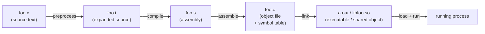
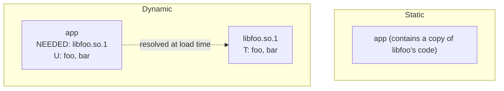
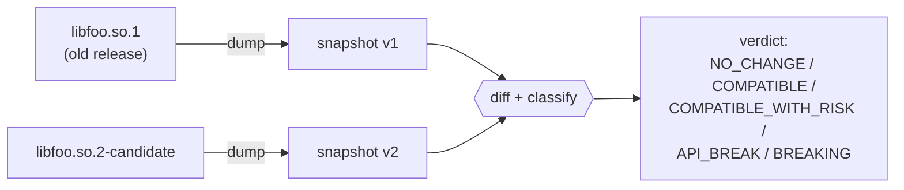

# Part 1 — Foundations: From Source Code to a Running Process

> **Series navigation:** **1. Foundations** ·
> [2. Symbol Contracts](02-symbol-contracts.md) ·
> [3. Type Layout](03-type-layout.md) ·
> [4. C++ ABI](04-cpp-abi.md) ·
> [5. Linker & ELF](05-linker-elf.md) ·
> [6. Transitive Breaks](06-transitive-breaks.md) ·
> [7. Designing for Stability](07-designing-for-stability.md)

**What you'll learn on this page**

- The journey a `.c`/`.cpp` file takes to become a running process, and where
  *compatibility* is decided at each step.
- What a **symbol** really is, and the difference between a symbol that is
  *defined* and one that is *undefined* (imported).
- The difference between **static** and **dynamic** linking, and why dynamic
  linking is where ABI compatibility matters.
- The two contracts every library publishes: the **API** (source-level) and the
  **ABI** (binary-level) — and why one break makes your compiler shout and the
  other one corrupts memory in silence.
- A mental model you can carry through the rest of the series: *the compiler
  bakes the library's promises into the caller, and never re-checks them.*

This page assumes **no prior knowledge** of linkers or loaders. If you already
know what `.dynsym`, COPY relocations, and the dynamic loader are, skip ahead to
[Part 2 — Symbol Contracts](02-symbol-contracts.md).

!!! note "Mental model: ELF/Linux unless stated"
    This series teaches with the **ELF/Linux** model (symbols resolved *by
    name*, SONAME, version scripts) because it's the cleanest to reason about.
    Windows **PE/COFF** and macOS **Mach-O** add their own mechanisms —
    ordinal exports, import libraries, install names, compatibility versions,
    two-level namespaces, and platform-specific C++ ABIs. Where it matters the
    text calls it out; the consolidated map is in
    [Part 5 §PE/COFF and Mach-O parallels](05-linker-elf.md#pecoff-and-mach-o-parallels)
    and the [Platform Support reference](../../reference/platforms.md).

---

## 1. The build pipeline: where does a library come from?

When you run `gcc foo.c -o foo`, a single command hides four distinct stages.
Each stage hands a different *representation* of your program to the next:



1. **Preprocess.** `#include` directives are pasted in, macros expanded. This is
   the only stage that sees your *headers* — the textual interface a library
   publishes. Headers define the **API**.
2. **Compile.** The preprocessed source becomes assembly for one specific
   target (e.g. x86-64). Crucially, **this is where the compiler turns the
   library's promises into machine code.** If a header says
   `struct Point { int x; int y; }`, the compiler now *knows* `sizeof(Point)` is
   8 and the field `y` lives at byte offset 4 — and it bakes those numbers
   directly into every instruction that touches a `Point`.
3. **Assemble.** Assembly becomes an **object file** (`.o`): machine code plus a
   **symbol table** listing the names this file *provides* and the names it
   *needs*.
4. **Link.** The linker stitches object files (and libraries) together,
   resolving each "needed" name to a "provided" one, producing an executable or
   a shared library.

The single most important idea in this entire series lives in stage 2:

> **The compiler bakes the library's ABI facts into the caller and never
> re-checks them.** Offsets, sizes, register choices, and vtable slot numbers
> become *immediate constants* inside the caller's machine code. When the
> library later changes one of those facts, the caller keeps using the old
> number. Nobody re-validates it. That is why an ABI break is silent.

---

## 2. What is a symbol?

A **symbol** is a name with an address attached — the unit the linker and loader
trade in. Functions and global variables become symbols; local variables inside
a function do not.

Compile this file:

```c
// math.c
int add(int a, int b) { return a + b; }   // defined here
int counter;                              // defined here (global)

extern int log_event(int code);          // declared, NOT defined here

int tally(int x) {
    counter += x;
    return log_event(add(x, 1));          // needs add (local) + log_event (external)
}
```

Inspect the resulting symbol table:

```bash
$ gcc -c math.c -o math.o
$ nm math.o
0000000000000000 T add          # T = defined, in .text (code)
0000000000000004 C counter      # C = common/global data symbol
                 U log_event     # U = UNDEFINED — this file needs it from elsewhere
0000000000000014 T tally
```

Two categories matter for the rest of the series:

| Kind | `nm` letter | Meaning |
|------|-------------|---------|
| **Defined** (exported) | `T`, `D`, `B`, `W`… | "I provide this name; here is its code/data." |
| **Undefined** (imported) | `U` | "I use this name; somebody else must provide it." |

Linking is, at its heart, **matching every `U` to a `T`/`D` somewhere**. If a
single `U` has no match, the link (or the load) fails. The name is the *only*
key used for matching — not the function's parameter types, not the variable's
size. Hold onto that: it is the root cause of an entire family of breaks in
[Part 2](02-symbol-contracts.md).

### Names in C vs C++ — mangling

In C, the symbol name *is* the source name: `add` stays `add`. In C++, the
compiler **mangles** the name to encode the namespace, class, and parameter
types, so that `int add(int,int)` and `double add(double)` can coexist:

```bash
$ echo 'namespace geo { int add(int,int){return 0;} }' | g++ -x c++ -c - -o t.o
$ nm t.o | c++filt
0000000000000000 T geo::add(int, int)     # mangled symbol: _ZN3geo3addEii
```

Mangling means that in C++ a **parameter type, a `const` qualifier, or a
namespace change rewrites the symbol name** — turning a source-level edit into a
linker-level removal. We return to this repeatedly in [Part 4](04-cpp-abi.md).

---

## 3. Static vs dynamic linking

There are two ways the linker can satisfy your program's undefined symbols.

**Static linking** copies the needed code *into* your executable at build time.
The library's bytes become part of `a.out`. Once built, there is no further
dependency — and no further compatibility question, because nothing can change
underneath you.

**Dynamic linking** leaves the undefined symbols *unresolved* in your
executable and records a note that says "find these in `libfoo.so` at startup."
The resolution happens every time the program runs.



Dynamic linking is the default on Linux, macOS, and Windows because it saves
memory (one copy of `libc` shared by every process), allows security fixes
without rebuilding every consumer, and enables plugins. **But it creates a
contract that outlives the build:** the executable was compiled against
*today's* `libfoo.so`, yet it will be resolved against *whatever* `libfoo.so` is
installed when it runs — possibly years later, possibly a different version.

> **ABI compatibility is the promise that a future `libfoo.so` can still satisfy
> a binary built against an older one — without recompiling the binary.**

The rest of this series is a catalog of the ways that promise gets broken.

---

## 4. The dynamic loader: what happens at startup

When you launch a dynamically-linked program, a special component — the
**dynamic loader** (`ld.so` on Linux, `dyld` on macOS, the PE loader on
Windows) — runs *before* your `main()`. Its job:

1. Read the executable's list of needed libraries (`DT_NEEDED` entries on ELF).
2. Find and `mmap` each library into the process's address space.
3. Walk the executable's **relocations** — the list of "patch this address once
   you know where the symbol landed" notes — and resolve each undefined symbol
   by looking up its name in each library's **dynamic symbol table**
   (`.dynsym`).
4. If any name can't be found: `symbol lookup error` and the process dies before
   `main()`.

```bash
$ ./app
./app: symbol lookup error: ./app: undefined symbol: helper
```

This lookup is **by name only**. The loader does not know or check that `helper`
used to take two `int`s and now takes a `double` — it only checks that *a*
symbol called `helper` exists. That is both the strength of dynamic linking
(loose coupling) and the source of its most dangerous failure mode (silent
mismatch). A symbol that resolves successfully but means something different now
is the textbook **silent ABI break**.

> **Lazy vs immediate binding.** By default, function symbols are resolved
> *lazily* — on first call, via a trampoline (the PLT). With
> `LD_BIND_NOW=1` or `-Wl,-z,now`, everything resolves at startup. This only
> changes *when* a missing-symbol error surfaces, not *whether* it does.

---

## 5. Two contracts: API vs ABI

We can now state the central distinction precisely.

An **API** (Application Programming Interface) is the **source-level contract**:
the declarations a consumer's *source code* compiles against — function
signatures, type definitions, macros, templates, and the semantic guarantees
that go with them. The API lives in the **headers**. You experience an API break
at **compile time**: the build fails, the error points at a line, you fix it.

An **ABI** (Application Binary Interface) is the **binary-level contract**
between already-compiled artifacts: the exact byte layout of types, the symbol
names and their mangling, the calling convention (which register holds which
argument), vtable shapes, exception-unwinding metadata, and the relocation rules
the loader relies on. The ABI lives in the **compiled `.so`/`.dll`/`.dylib` and
the binaries built against it**. You experience an ABI break at **run time** —
or worse, you *don't* experience it, because it corrupts memory quietly.

| | **API break** | **ABI break** |
|---|---|---|
| Contract level | Source (headers) | Binary (compiled code) |
| Who notices | The compiler | Nobody — until it crashes or corrupts |
| When | Build time | Run time (or silently, never) |
| Fix | Edit + recompile consumer | Often impossible without rebuilding *every* consumer |
| Example | Renaming an enum member | Inserting a struct field |

The asymmetry is the whole point:

> **An API break forces downstream code to be edited; an ABI break does not —
> but it silently corrupts memory, misroutes calls, or fails to resolve symbols
> at load time, because the consumer binary was produced under assumptions the
> new library no longer satisfies.**

A change can be one, the other, both, or neither:

- **API break only** — rename a function in the header but keep the old exported
  symbol via an alias. Old binaries still link; new source won't compile against
  the old name.
- **ABI break only** — add a field to a struct. Source that uses the struct
  still compiles fine; old binaries that baked in the old `sizeof` corrupt
  memory.
- **Both** — remove a function entirely.
- **Neither** — change a comment, or an implementation detail behind an opaque
  pointer.

---

## 6. Why ABI breaks are expensive

The cost of an ABI break compounds with the size of the ecosystem depending on
the library. When `libfoo.so.1` breaks ABI without changing its identity, the
damage radiates:

- **Linux distributions** must rebuild — and re-test, re-sign, and re-ship —
  *every* reverse-dependency in the archive. Debian and Fedora each track
  hundreds of such "library transitions" per release; a single unannounced ABI
  break can stall an entire distribution's release.
- **Embedded / firmware:** an ABI break shipped in an over-the-air update can
  brick devices in the field, when a pre-linked application loads a new system
  library whose struct offsets have shifted.
- **Plugin ecosystems** — audio hosts loading VST modules, game engines loading
  mods, browsers loading components, IDEs loading extensions — fracture
  entirely when the host's ABI changes. Third-party binaries shipped years
  earlier fault on first call, and the plugin author may no longer exist to
  rebuild them.

This is why mature libraries treat ABI as a versioned, gated, deliberately
managed surface — and why a tool that can *tell you* whether a change is
ABI-breaking before you ship belongs in your CI pipeline.

---

## 7. Where abicheck fits

`abicheck` operationalizes everything above. It does not need your source at
review time; it reads the *compiled* artifacts (plus debug info / headers when
available) and reasons about the binary contract directly.



1. **Snapshot.** It extracts an `AbiSnapshot` from each binary — the exported
   symbols, type layouts, vtables, calling conventions, ELF metadata, and so on.
2. **Diff.** It compares the two snapshots structurally (walking pointer chains,
   struct members, vtable slots — not just symbol names).
3. **Classify.** Each detected difference is one of **180+ change kinds**, and
   each change kind is partitioned into exactly one verdict tier.

The five verdicts, from safest to most severe, are:

| Verdict | Meaning | Typical CI action |
|---|---|---|
| ✅ `NO_CHANGE` | Identical ABI/API | pass |
| 🟢 `COMPATIBLE` | Backward-compatible (additions / quality signals) | pass |
| 🟡 `COMPATIBLE_WITH_RISK` | Links fine, but a deployment/behavioral hazard | review |
| 🟠 `API_BREAK` | Source won't recompile; binaries still link | review / bump minor |
| 🔴 `BREAKING` | Existing binaries crash or corrupt at runtime | block / bump SONAME |

Each verdict maps to a CI exit code so a release gate can distinguish a harmless
symbol addition from a silent memory-corruption hazard. The full semantics and
exit codes are in [Verdicts](../verdicts.md); a one-screen summary is the
[ABI Cheat Sheet](../abi-cheat-sheet.md).

Throughout the rest of the series, look for callouts like this:

!!! note "How abicheck sees it"
    Inline boxes like this name the specific **change kind** and **verdict**
    abicheck reports for the scenario being discussed, and how it detects it
    (ELF symbol table, DWARF debug info, or headers). They tie the general
    mechanism back to something you can run in CI.

---

## 8. Glossary

| Term | One-line definition |
|------|---------------------|
| **Symbol** | A name (function or global) the linker/loader resolves to an address. |
| **Defined / Undefined symbol** | A name this object *provides* vs *needs* (`T` vs `U` in `nm`). |
| **`.dynsym`** | A shared object's table of dynamically-visible symbols, searched at load time. |
| **Relocation** | A "patch this address once the symbol's location is known" note in a binary. |
| **Dynamic loader** | `ld.so` / `dyld` / PE loader — resolves symbols and maps libraries at startup. |
| **Mangling** | Encoding of C++ name + signature into a flat symbol string. |
| **SONAME** | A shared object's *declared identity* (`libfoo.so.1`); the major number is the ABI epoch. |
| **Calling convention** | The register/stack contract for passing arguments and returning values. |
| **Vtable** | A per-class array of function pointers backing C++ virtual dispatch. |
| **API** | Source-level contract (headers). Breaks at compile time. |
| **ABI** | Binary-level contract (compiled artifacts). Breaks at run time, often silently. |

---

## Next

Now that you know what a symbol is and how it's resolved, the most direct way to
break a library is to make a symbol the loader needs *disappear* or *change
meaning*. That is the subject of the next page.

➡️ **[Part 2 — Symbol Contract Breaks](02-symbol-contracts.md)**

*See also:* [ABI Cheat Sheet](../abi-cheat-sheet.md) ·
[Verdicts](../verdicts.md) ·
[Examples Encyclopedia](../../examples/index.md)
