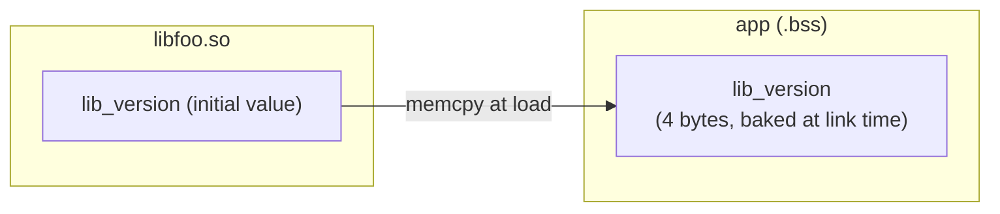

# Part 2 — Symbol Contract Breaks

> **Series navigation:** [1. Foundations](01-foundations.md) ·
> **2. Symbol Contracts** ·
> [3. Type Layout](03-type-layout.md) ·
> [4. C++ ABI](04-cpp-abi.md) ·
> [5. Linker & ELF](05-linker-elf.md) ·
> [6. Transitive Breaks](06-transitive-breaks.md) ·
> [7. Designing for Stability](07-designing-for-stability.md)

**What you'll learn on this page**

- Why the dynamic loader's *name-only* lookup makes symbol removal an instant,
  hard failure — and a rename an invisible removal.
- How a function whose **signature** changes still resolves, then reads its
  arguments from the wrong registers.
- Why a `int *` → `int **` change is invisible "on the wire" but catastrophic at
  the dereference.
- Why **exported global variables** are the hardest thing to evolve compatibly,
  thanks to COPY relocations.
- The five design moves that keep the symbol contract intact.

Recommended prerequisite: [Part 1 — Foundations](01-foundations.md) (symbols,
the loader, name-only resolution).

---

## The shared mechanism

From [Part 1](01-foundations.md): the dynamic loader resolves every external
reference **by name**, at load time or first call. A symbol that existed at link
time but is missing at load time is a hard error — no fallback, no default, just
`symbol lookup error` and process termination.

!!! note "Name-keyed is the ELF model (and most C/C++ exports)"
    This "lookup by name" contract is exact for ELF and for the public C/C++
    exports you normally care about. **Windows PE/COFF DLLs can also export and
    import by *ordinal*** — a small integer index into the export table — in
    which case the contract is the *number*, and renaming the symbol does not
    break an ordinal-bound caller while reordering the export table does. Mach-O
    uses a two-level namespace that records *which* library a name came from, so
    the same bare name from a different install name is a different contract. See
    [Part 5 §PE/COFF and Mach-O parallels](05-linker-elf.md#pecoff-and-mach-o-parallels).

The four break classes below each violate the name-keyed contract in a different
way:

1. by **erasing** the name (removal / rename),
2. by **keeping** the name but changing what its arguments mean (signature),
3. by keeping the same *size* on the wire but changing the *meaning* of the
   bytes (pointer level),
4. by letting a **data symbol** drift out from under consumers that baked its
   layout into their own binary (globals).

---

## 1. Removing or renaming symbols

### The mechanism

When an executable is linked against `libfoo.so.1`, every reference to a library
function is recorded as a **named relocation** — in `.rela.plt` for functions,
`.rela.dyn` for data. At load time the loader walks those relocations and looks
each name up in the library's `.dynsym`. If the name is absent, the lookup
returns nothing and the process aborts: before `main()` under immediate binding,
or at the first PLT trampoline under the default lazy binding.

A **rename is the same event seen twice**: from the loader's viewpoint, renaming
`fast_add` to `fast_add_v2` is a removal of the old name plus an addition of a
new one. Every pre-existing binary still asks for `fast_add`, and it is gone.

### Minimal scenario

```c
// v1 — exports two functions
int compute(int x) { return x * 2; }
int helper(int x)  { return x + 1; }

// v2 — helper is dropped
int compute(int x) { return x * 2; }
```

Every downstream binary that ever called `helper` now fails:

```bash
$ ./app
./app: symbol lookup error: ./app: undefined symbol: helper
```

Name identity is the *only* key `.dynsym` is indexed by — which is exactly why
the loader cannot tell a removal from a rename, and why **neither is safe
without a SONAME bump**.

!!! note "How abicheck sees it"
    `func_removed` → 🔴 **BREAKING**, detected straight from the ELF/PE/Mach-O
    symbol table — no debug info required. (Removed exported *variables* are
    reported as `var_removed`; see §4.)
    See [case01](../../examples/case01_symbol_removal.md) (a `helper` that
    disappears) and [case12](../../examples/case12_function_removed.md)
    (`fast_add` removed while an unrelated `other_func` is added — proving the
    loader matches names, not "function count").

---

## 2. Changing function signatures

### The mechanism

In C, the signature is **not part of the symbol name**: `process` mangles to
`process` whether it takes `(int, int)` or `(double, int)`. So the loader
cheerfully binds a v1 caller to a v2 implementation whose parameter types
disagree — the names match, and that's all it checks.

What goes wrong lives in the **calling convention**. On the x86-64 System V ABI,
the first integer-class arguments go in `RDI, RSI, RDX, RCX, R8, R9` and the
first floating-point arguments go in `XMM0..XMM7`, drawn from *two independent
queues*. Change a parameter's *class* and the caller and callee now disagree
about *which register* holds it.

### Minimal scenario — argument path

```c
/* v1 */ double process(int a, int b)    { return (double)(a + b); }
/* v2 */ double process(double a, int b) { return a + b; }
```

The v1 caller loads an integer into `EDI`. The v2 callee reads a floating-point
value from `XMM0` — a *different register entirely* — and `XMM0` holds whatever
garbage the caller last left there. No crash, no diagnostic, just a wrong
answer.

### Minimal scenario — return path

```c
/* v1 */ int  get(void)  { return 3000000000; }   // caller reads EAX (32-bit)
/* v2 */ long get(void)  { return 3000000000; }   // callee writes RAX (64-bit)
```

The v2 callee writes all 64 bits of `RAX`; the v1 caller reads only `EAX`,
truncating `3000000000` to `-1294967296`.

Struct-passing changes are worse still: aggregates straddle the register/stack
boundary by classification rules that depend on size, alignment, and member
types — so a single added `int64_t` field can push an entire argument onto the
stack, shifting every later argument.

!!! note "How abicheck sees it"
    `func_params_changed` / `func_return_changed` → 🔴 **BREAKING**, recovered
    from DWARF (or headers). The exported symbol name is unchanged, so a
    name-only `nm` diff sees nothing.
    [case02](../../examples/case02_param_type_change.md) (argument widening),
    [case10](../../examples/case10_return_type.md) (return widening).

---

## 3. Pointer-level changes

### The mechanism

Every pointer on a 64-bit target occupies 8 bytes, so `int *` and `int **` look
**identical** in a symbol's size on the wire. They are not identical in
*semantics*. One level of indirection is the difference between "the address of
an int" and "the address of (the address of an int)".

### Minimal scenario

```c
/* v1 */ void process(int *data)  { buf[0] = *data; }
/* v2 */ void process(int **data) { buf[0] = **data; }
```

A v1 caller passes the address of a stack `int`. v2 treats that address as an
`int *` and dereferences it *again* — reading the 32-bit integer *value* as if
it were a 64-bit pointer. The result is almost always an unmapped-page fault;
but on an unlucky memory layout the synthesised "pointer" lands inside a valid
mapping and the library silently reads or writes the wrong bytes — corruption
with no crash to trace back to. The same failure occurs on the return path: if
`get_buffer()` grows from `int *` to `int **`, callers index through a
pointer-to-pointer as if it were a flat buffer and walk off into arbitrary
memory.

!!! note "How abicheck sees it"
    `param_pointer_level_changed` (and `return_pointer_level_changed` on the
    return path) → 🔴 **BREAKING**. abicheck walks the pointer chain
    *structurally* during diff, so it distinguishes "both sides return a
    pointer" from "the indirection level changed."
    [case33](../../examples/case33_pointer_level.md).

---

## 4. Global variable changes

Exported globals are the **hardest class to refactor compatibly**, because the
executable bakes layout facts about the variable into *its own* binary at link
time.

### The mechanism: COPY relocations

On ELF, a reference to an imported data symbol from a non-PIE executable
typically generates a **COPY relocation**. The linker allocates space *in the
executable's own `.bss`* sized to `sizeof(v1_type)`, and at load time the loader
`memcpy`s the library's initial value into that executable-owned slot.
Thereafter **both sides** read and write the executable's copy.



Now widen the type:

```c
/* v1 */ int  lib_version;   // app reserved 4 bytes
/* v2 */ long lib_version;   // library writes 8 bytes
```

The executable's 4-byte slot cannot hold the 8-byte value. The loader either
warns about a size mismatch or silently truncates — the app reads `705032704`
where the library wrote `5000000000`.

Two more flavors of the same root cause:

- **Removal** ([case58](../../examples/case58_var_removed.md)): the COPY
  relocation has no target; the process fails to start with
  `undefined symbol: lib_debug_level`.
- **Qualifier flip** ([case39](../../examples/case39_var_const.md)): making a
  mutable global `const` can move it from writable `.bss`/`.data` into the
  library's `.rodata`. Under COPY relocation the app keeps writing its private
  copy while the library's updates never propagate (silent divergence); under
  PIE/GOT access the app's write faults with `SIGSEGV`.

!!! note "How abicheck sees it"
    `var_type_changed` / `var_removed` / `var_became_const` → 🔴 **BREAKING**,
    detected from the symbol table plus DWARF type info.
    [case11](../../examples/case11_global_var_type.md),
    [case58](../../examples/case58_var_removed.md),
    [case39](../../examples/case39_var_const.md).

---

## How to keep the symbol contract intact

!!! tip "Design patterns for Part 2"
    - **Deprecate, don't delete.** Mark outgoing functions
      `__attribute__((deprecated))` for at least one release, ship an alias
      (`__attribute__((alias("new_name")))`) spanning old and new names, and
      only remove on a SONAME bump.
    - **Use versioned symbols.** A linker version script
      (`GLIBC_2.17 { global: foo; };`) lets you ship `foo@GLIBC_2.17` alongside
      `foo@@GLIBC_2.34`, so pre-existing binaries keep resolving to the old
      implementation while new links pick up the new one. (See
      [Part 5](05-linker-elf.md).)
    - **Prefer accessors over exported globals.** `int get_version(void)` is
      immune to COPY-relocation hazards and lets the library change storage,
      width, or qualifier without touching consumers.
    - **Freeze signatures; add new entry points.** Model the
      `ftell` → `ftello` pattern: ship a *new* symbol for the new type rather
      than widening the existing one.
    - **Hide layout behind opaque handles.** Publish
      `typedef struct foo foo_t;` with only `foo_t *` in the public header and
      force consumers through functions — the library then owns the struct's
      size and layout outright. (Developed fully in
      [Part 7](07-designing-for-stability.md).)

---

## Next

Symbols are the *names* that cross the boundary. The *types* those symbols carry
have an internal byte layout that the compiler bakes into every caller — and
shifting one offset is a whole second family of silent breaks.

➡️ **[Part 3 — Type Layout Breaks](03-type-layout.md)**

*See also:* [ABI Cheat Sheet](../abi-cheat-sheet.md) ·
[Verdicts](../verdicts.md) ·
[BREAKING examples](../../examples/by-verdict/breaking.md)
