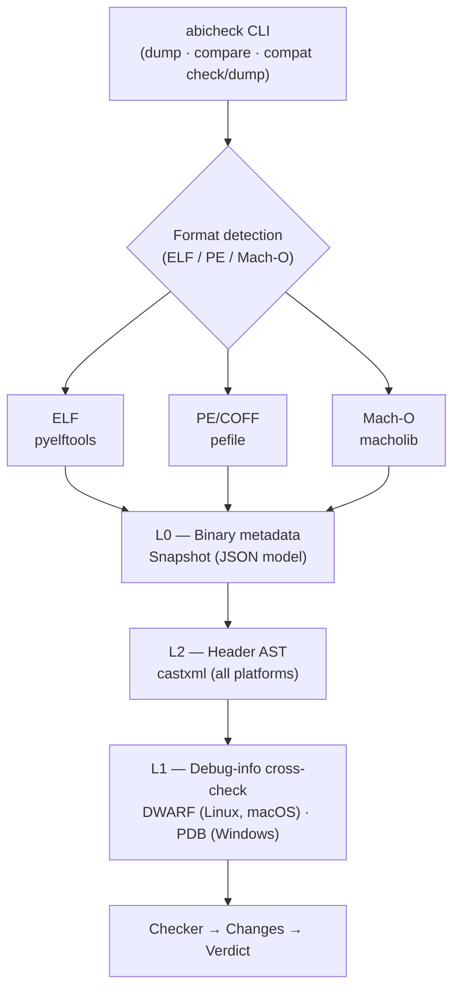
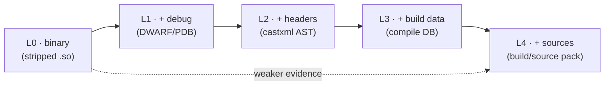

# Architecture

## Overview

abicheck is a Python CLI tool that compares two versions of a C/C++ shared library
to detect ABI and API incompatibilities. Its core design idea is to reason over
**five independent sources of information** about a library — the binary, its
debug symbols, its public headers, its build-system data, and (optionally) its
sources — instead of relying on a single data source. Each source is an additive
**evidence layer** (`L0`–`L4`); feeding more layers both finds breaks the
weaker layers are blind to and suppresses false positives they would raise. See
[Evidence layers: the five sources](#evidence-layers-the-five-sources) below for
the model, and [Evidence & Detectability](evidence-and-detectability.md) for the
conceptual companion.

**Supported platforms and binary formats:**

| Platform | Binary format | Binary metadata | Header AST (castxml) | Debug info cross-check |
|----------|--------------|:---------------:|:--------------------:|:----------------------:|
| Linux | ELF (`.so`) | Yes (pyelftools) | Yes (GCC, Clang) | Yes (DWARF) |
| Windows | PE/COFF (`.dll`) | Yes (pefile) | Yes (MSVC, MinGW) | Planned (PDB) |
| macOS | Mach-O (`.dylib`) | Yes (macholib) | Yes (Clang, GCC) | Yes (DWARF) |

---

## Analysis pipeline

The CLI dumps each input into a normalized snapshot, enriches it with header
AST and debug-info layers, then diffs the two snapshots to produce a verdict:



The analysis layers are independent and additive — each catches changes the
others miss, and the checker reconciles them into a single verdict. The
artifact layers (L0/L1/L2) are described in detail below; the build/source
layers (L3/L4, plus the optional L5 reachability graph) are covered in
[Build & Source Packs](build-source-data.md).

---

## Evidence layers: the five sources

abicheck's accuracy comes from treating compatibility analysis as a question of
*evidence*: the more independent sources of information you give it about a
library, the more it can prove — and the fewer false positives it raises. There
are five, layered from the least input to the most:

| Layer | Source | Collected from | Authority | Reveals |
|:-----:|--------|----------------|-----------|---------|
| **L0** | Just the **binary** | ELF/PE/Mach-O parsers (`elf_metadata.py`, `pe_metadata.py`, `macho_metadata.py`) | Authoritative | Exported symbols, SONAME/install-name, versions, visibility, binding, dependencies |
| **L1** | **Debug symbols** | DWARF/PDB/BTF/CTF (`dwarf_*`, `pdb_*`, `btf_metadata.py`, `ctf_metadata.py`) | Authoritative when matched to the binary | Type **layout**: sizes, field offsets, enum values, vtable slots, calling convention, packing |
| **L2** | **Public headers** | castxml AST (`dumper_castxml.py`) | Authoritative for header-visible API | Source **API**: signatures, overloads, access, `final`/`explicit`/`noexcept`, templates, public/internal scoping |
| **L3** | **Build system data & options** | compile DB / CMake / Ninja / Bazel / Make (`build_context.py`, build/source pack ADR-029) | Context / confidence | ABI-relevant flags (`-std`, `_GLIBCXX_USE_CXX11_ABI`, `-fvisibility`, `-fabi-version`), toolchain, target graph, export policy |
| **L4** | **Sources** | per-TU source ABI replay (build/source pack ADR-030) | Source-/API-risk evidence, never sole shipped-ABI authority | Macro/`constexpr` values, default-argument values, inline/template bodies, uninstantiated templates |



**The authority rule (ADR-028).** The layers are not a fallback chain — abicheck
overlays everything it is given and computes one worst-wins verdict. But not all
evidence carries the same weight:

> Artifact-backed **L0/L1/L2** evidence is **authoritative** for the shipped-ABI
> verdict. Build/source **L3/L4** evidence may *explain, localize, scope, or add
> confidence to* a finding, and may raise its own source-/API-level findings
> (default `API_BREAK` or risk) — but it **never silently deletes** an
> artifact-proven break.

So L3 noticing a `-std` bump or L4 noticing a changed macro can *add* a finding
or *explain* one, but only L0/L1/L2 can declare a binary `BREAKING`. Every
compare that uses build/source evidence prints an **evidence-coverage** table
(and a structured `layer_coverage` array in JSON) so consumers can tell which
findings are artifact-proven vs. context-only — see [Build & Source Packs](build-source-data.md).

**Graceful degradation.** `abicheck dump --show-data-sources` reports exactly
which of L0/L1/L2 a binary affords and how many detectors that enables
(symbols-only ≈ 6/30, DWARF-only ≈ 24/30, with headers 30/30). With less input
abicheck degrades down the staircase rather than failing; with more it both
finds more and false-positives less. The empirical per-tier behaviour across the
example catalog is benchmarked in
[Tool Comparison §Benchmarking by evidence tier](../reference/tool-comparison.md#benchmarking-by-evidence-tier).

---

## Artifact layers in detail

### Layer L0: Binary metadata

Reads native binary metadata using format-specific parsers:

**ELF** (Linux, via `pyelftools`):
- Exported symbols (functions, variables) from `.dynsym`
- SONAME, symbol binding (GLOBAL, WEAK, LOCAL), symbol versioning
- NEEDED dependencies, visibility attributes

**PE/COFF** (Windows, via `pefile`):
- Exported functions and ordinals from the export table
- Imported DLLs and functions from the import table
- Machine type, characteristics, DLL characteristics
- File and product version from VS_FIXEDFILEINFO resource

**Mach-O** (macOS, via `macholib`):
- Exported symbols from the symbol table (including weak definitions)
- Install name (LC_ID_DYLIB — equivalent of ELF SONAME)
- Dependent libraries (LC_LOAD_DYLIB — equivalent of ELF DT_NEEDED)
- Re-exported libraries (LC_REEXPORT_DYLIB)
- Current and compatibility versions, minimum OS version
- Fat/universal binary support (automatic architecture selection)

### Layer L2: Header AST (castxml / Clang) — all platforms

Parses C/C++ headers through castxml to extract:

- Function signatures (parameters, return types)
- Class/struct definitions and layout
- Virtual method tables (vtable slot ordering)
- Enum values and member names
- Typedefs and template instantiations
- `noexcept` specifications
- Access levels (public, protected, private)

castxml is a cross-platform tool maintained by Kitware (available via conda-forge,
system packages, or direct download for Linux, Windows, and macOS). It is the primary
source for type-level analysis, catching changes invisible to debug-info-only tools:
`noexcept`, `static` qualifier, const qualifier, access level changes.

**Compiler support:** castxml uses an **internal Clang compiler** for parsing but
**emulates** the preprocessor defines, include paths, and target platform of an external
compiler via `--castxml-cc-<id> <compiler-binary>`. At invocation castxml calls the
external compiler to discover its built-in defines (e.g. `__GNUC__`, `__GNUC_MINOR__`,
`_MSC_VER`) and default include search paths, then injects those into its internal Clang
so the resulting AST matches what the external compiler would produce.

| Compiler ID | Compiler | Typical platforms |
|-------------|----------|-------------------|
| `gnu` | GCC / g++ | Linux, macOS, Windows (MinGW) |
| `gnu-c` | GCC / gcc (C mode) | Linux, macOS, Windows (MinGW) |
| `msvc` | Microsoft Visual C++ (cl) | Windows |
| `msvc-c` | Microsoft Visual C (cl, C mode) | Windows |

**Auto-detection logic** (see `dumper.py:_castxml_dump()`): abicheck extracts the
*filename* from the compiler binary path (via `Path(cc_bin).name`), lower-cases it, and
checks whether it is `cl` or `cl.exe`. If so, it passes `--castxml-cc-msvc`; otherwise it
passes `--castxml-cc-gnu`. The comparison is case-insensitive so `CL.EXE`, `Cl.exe`, etc.
are all correctly detected on Windows.

**Compiler resolution priority** (highest to lowest):

1. `--gcc-path /path/to/compiler` — explicit path override, used as-is
2. `--gcc-prefix <prefix>` — cross-toolchain prefix; abicheck appends `g++` (C++ mode)
   or `gcc` (C mode) automatically
3. Default mapping — logical name (`c++` → `g++`, `cc` → `gcc`, `clang++` → `clang++`)

**Scanning with a specific compiler version:** use `--gcc-path` to point at the exact
binary. castxml queries that binary for its version-specific predefined macros and include
paths, so the parse reflects exactly what that compiler version defines:

```bash
abicheck dump libfoo.so -H foo.h --gcc-path /usr/bin/g++-9   # GCC 9
abicheck dump libfoo.so -H foo.h --gcc-path /usr/bin/g++-12  # GCC 12
```

**Limitations — non-C/C++ languages and compiler extensions:**

castxml can only parse **C and C++** because its internal engine is Clang. It cannot parse
Fortran, Rust, Ada, or other languages — there is no `--castxml-cc-fortran` equivalent.
For compilers that add language extensions beyond standard C/C++ (e.g. Intel DPC++/SYCL
`__attribute__((sycl_kernel))`, CUDA `__global__`, OpenACC pragmas), castxml can query
the external compiler's preprocessor state but its internal Clang will reject
extension-specific syntax during parsing. To scan such headers you would need either a
CastXML build linked against the matching Clang fork (e.g. Intel's DPC++ Clang for SYCL)
or a different AST extraction tool that uses that compiler's libclang directly.

### Layer L1: Debug info cross-check (optional)

When debug info is available in the binary:

**DWARF** (Linux `.so`, macOS `.dylib` — via `pyelftools`):
- Cross-validates struct/class sizes against header-computed sizes
- Verifies member offsets (catches `#pragma pack` or `-march`-specific alignment differences)
- Checks vtable slot offsets
- Detects calling convention and frame register changes

**PDB** (Windows `.dll` — via built-in PDB parser):
- Extracts struct/class/union sizes and field layouts from TPI stream
- Extracts enum underlying types and member values
- Detects calling convention changes (`__cdecl`, `__stdcall`, `__fastcall`,
  `__thiscall`, `__vectorcall`) from `LF_PROCEDURE` / `LF_MFUNCTION` records
- Extracts MSVC toolchain info (version, machine type, ABI flags) from DBI stream
- Auto-discovers PDB files from PE debug directory; use `--pdb-path` to override

**Debug artifact resolution** (via `debug_resolver` module):

When debug info is not embedded, abicheck searches a configurable resolver
chain: split DWARF (.dwo/.dwp), build-id trees, path mirrors, dSYM bundles,
PDB files, and optionally debuginfod servers. Use `--debug-root` to point at
separate debug file directories, or `--debuginfod` for network-based resolution.

### Layers L3 / L4: Build & source evidence (optional)

The build (L3) and source (L4) layers are **post-build, opt-in, and never
authoritative on their own** — abicheck reads existing build outputs and
build-system query interfaces; it does not rebuild your project. They are
collected into a content-addressed **build/source pack** and attached to a snapshot:

- **L3 — build context** (`build_context.py`, ADR-029): parses a
  `compile_commands.json` (`-p build/`) or a CMake/Ninja/Bazel/Make graph to
  recover the exact ABI-relevant flags and toolchain the library was built with.
  Diffs emit context/risk kinds like `abi_relevant_build_flag_changed`,
  `toolchain_version_changed`, and `link_export_policy_changed`.
- **L4 — source ABI replay** (ADR-030): parses selected TUs and public headers
  under their real per-TU build context and links the result against the
  exported surface, catching `public_macro_value_changed`,
  `default_argument_changed`, `constexpr_value_changed`, and the uninstantiated
  templates that no artifact carries.

Both are described in full in [Build & Source Packs](build-source-data.md). Per the
authority rule, every L3/L4 finding defaults to `API_BREAK` or risk and carries
an explicit evidence-tier boundary so it is never read as a proven shipped-ABI
break.

---

## Key modules

### CLI & service layer

| Module | Responsibility |
|--------|---------------|
| `cli.py` | CLI entrypoint — `dump`, `compare`, `compat check`, `compat dump`, `deps`, `stack-check`, `baseline`, `appcompat` commands |
| `service.py` | Service layer — shared orchestration for CLI and MCP server (`resolve_input`, `run_dump`, `run_compare`, `render_output`) |
| `mcp_server.py` | MCP (Model Context Protocol) server for AI agent integration |
| `build_context.py` | `compile_commands.json` parsing and per-TU flag extraction |
| `debug_resolver.py` | Debug artifact resolution chain (DWARF, PDB, dSYM, debuginfod) |
| `baseline.py` | Baseline registry — push/pull/list/delete with SHA-256 integrity verification |

### Data model & serialization

| Module | Responsibility |
|--------|---------------|
| `model.py` | Data models for snapshots (AbiSnapshot, Function, RecordType, EnumType, etc.) |
| `checker_types.py` | Core result types (`Change`, `DiffResult`, `DetectorSpec`, `LibraryMetadata`) — extracted from `checker.py` to break circular dependencies |
| `serialization.py` | JSON snapshot serialization/deserialization |
| `errors.py` | Custom exception definitions |

### Snapshot generation (dumper)

| Module | Responsibility |
|--------|---------------|
| `dumper.py` | Snapshot generation: reads binary + headers → JSON snapshot |
| `elf_metadata.py` | ELF reader — Linux `.so` binaries (via `pyelftools`) |
| `pe_metadata.py` | PE/COFF reader — Windows `.dll` binaries (via `pefile`) |
| `macho_metadata.py` | Mach-O reader — macOS `.dylib` binaries (via `macholib`) |
| `binary_utils.py` | Shared binary format utilities |

### Diff engine (checker)

| Module | Responsibility |
|--------|---------------|
| `checker.py` | Diff orchestration: compares two snapshots, delegates to sub-modules, collects changes |
| `checker_policy.py` | `ChangeKind` enum, built-in policy profiles (`strict_abi`, `sdk_vendor`, `plugin_abi`), verdict computation |
| `diff_symbols.py` | Symbol-level ABI diff detectors (functions, variables, parameters) |
| `diff_types.py` | Type-level ABI diff detectors (structs, enums, unions, typedefs, fields) |
| `diff_platform.py` | Platform-specific ABI diff detectors (ELF, PE, Mach-O, DWARF) |
| `diff_filtering.py` | Post-processing: enrichment, redundancy filtering, AST-DWARF deduplication |
| `detectors.py` | Individual ABI change detection rules |

### Policy & suppression

| Module | Responsibility |
|--------|---------------|
| `policy_file.py` | Custom YAML policy file parsing (`--policy-file`) |
| `suppression.py` | Suppression rules, symbol/type filtering |
| `severity.py` | Severity classification for changes |

### Report output

| Module | Responsibility |
|--------|---------------|
| `reporter.py` | Markdown and JSON output formatting |
| `html_report.py` | HTML report generation |
| `sarif.py` | SARIF output for GitHub Code Scanning |
| `report_classifications.py` | Change classification helpers for reports |
| `report_summary.py` | Report summary generation |

### Debug info (DWARF & PDB)

| Module | Responsibility |
|--------|---------------|
| `dwarf_unified.py` | Unified DWARF handling (layer 3, Linux/macOS) |
| `dwarf_advanced.py` | Advanced DWARF analysis (calling convention, packing, toolchain flags) |
| `dwarf_metadata.py` | DWARF metadata extraction (Linux/macOS) |
| `dwarf_snapshot.py` | DWARF-based snapshot enrichment |
| `dwarf_utils.py` | DWARF parsing utility functions |
| `pdb_parser.py` | Minimal PDB parser (MSF container, TPI, DBI streams) |
| `pdb_metadata.py` | PDB debug info → DwarfMetadata/AdvancedDwarfMetadata |
| `pdb_utils.py` | PDB file location from PE debug directory |

### Dependency & stack analysis

| Module | Responsibility |
|--------|---------------|
| `resolver.py` | Dependency tree resolution (ELF `DT_NEEDED` / Mach-O `LC_LOAD_DYLIB`) |
| `binder.py` | Symbol binding simulation across loaded DSOs |
| `stack_checker.py` | Full-stack ABI validation across dependency trees |
| `stack_report.py` | Stack-check report formatting |
| `appcompat.py` | Application compatibility checking (filters diff to app-used symbols) |
| `package.py` | Package-level comparison (RPM, DEB, conda) |

### ABICC compatibility

| Module | Responsibility |
|--------|---------------|
| `compat/` | ABICC compatibility layer (compat check, compat dump, XML parsing) |
| `compat/abicc_dump_import.py` | Import Perl-format ABICC dump files |
| `demangle.py` | C++ symbol demangling utilities |

---

## Policy model

Policies control how detected changes are classified (BREAKING, API_BREAK, COMPATIBLE).

**Built-in profiles:**

| Profile | Behavior |
|---------|----------|
| `strict_abi` (default) | Every ABI change at maximum severity |
| `sdk_vendor` | Source-only changes downgraded to COMPATIBLE |
| `plugin_abi` | Calling-convention changes downgraded to COMPATIBLE |

**Custom policies:** YAML files with per-kind `break|warn|ignore` overrides.

Source of truth: `BREAKING_KINDS`, `API_BREAK_KINDS`, `COMPATIBLE_KINDS`, and `RISK_KINDS` sets in `checker_policy.py`.

---

## Verdict system

| Verdict | Exit code | Meaning |
|---------|-----------|---------|
| `NO_CHANGE` | 0 | Identical snapshots |
| `COMPATIBLE` | 0 | Safe changes (new symbols, weak binding) |
| `COMPATIBLE_WITH_RISK` | 0 | Binary-compatible but deployment risk present |
| `API_BREAK` | 2 | Source-level break, binary-safe (rename, access change) |
| `BREAKING` | 4 | Binary ABI break — old binaries will fail |

---

## Error model

Public exceptions are defined in `abicheck/errors.py`. Tool errors produce exit code `1`.
