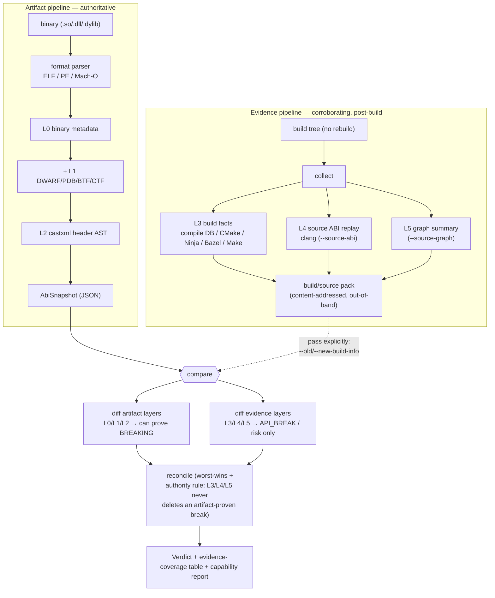

# Source & Build Data

abicheck primarily compares **built artifacts** — binaries (L0), debug info
(L1), and public headers (L2). A **build/source pack** is an *optional* sidecar
that augments a snapshot with **source and build evidence** (ADR-028): build
context (L3), and — in later releases — source ABI replay (L4) and source
graph summaries (L5).

The pack exists to give the existing ABI/API decision engine **more facts** —
to reduce false positives, explain and localize breaks, and detect
source/API risks artifact comparison cannot see. It does **not** turn abicheck
into a general static analyzer.

## The authority rule (the one rule that matters)

> **Artifact-backed L0/L1/L2 evidence remains authoritative for shipped-ABI
> verdicts.** Source/build evidence (L3/L4/L5) may *explain, localize, scope,
> add confidence/provenance, or correlate* an artifact-proven break — but it
> **never silently deletes** one.

Findings produced *only* by build/source evidence are ordinary
[change kinds](../reference/change-kinds.md) that default to **`API_BREAK`**
(source-level breaks) or **risk** (deployment/context risk), never **breaking**
unless an artifact diff also proves the break. They flow through the normal
[verdict](verdicts.md) computation with worst-verdict-wins.

## Evidence layers

| Layer | Source | Purpose | Verdict authority |
|---|---|---|---|
| L0 | ELF/PE/Mach-O | Exported binary ABI facts | Authoritative |
| L1 | DWARF/PDB/BTF/CTF | Layout/type/calling-convention | Authoritative when matched to binary |
| L2 | castxml/public headers | Public API declarations | Authoritative for header-visible API |
| **L3** | compile DB, CMake, Ninja, Bazel, Make | Toolchain, flags, target graph, generated-file provenance | Context/confidence |
| **L4** | per-TU source ABI replay | Source-visible ABI/API facts | API/source-risk evidence; never sole shipped-ABI authority |
| **L5** | Clang/Kythe/CodeQL graph summaries | Include/type/call/build reasoning | Explanation, localization, impact |

L3 and L4 are implemented today (ADR-029, ADR-030). L4 ships three extractor
backends — **clang** (the source-based default: inline/template/constexpr body
fingerprints + default arguments), **castxml** (declarations/types/const values),
and an **Android** header-checker adapter — plus the linker, source-replay diff,
replay scopes, and per-TU cache (see [L4 findings](#source-abi-replay-findings-l4)).

L5 has landed (ADR-031, phases 1–4): a compact, abicheck-owned **source graph
summary**. Folded from the L3 build evidence it carries `target`,
`compile_unit`, `source`, `header`, `generated_file`, and `build_option` nodes
linked by `TARGET_HAS_SOURCE` / `TARGET_HAS_PUBLIC_HEADER` / `TARGET_DEPENDS_ON`
/ `COMPILE_UNIT_BUILDS_SOURCE` / `COMPILE_UNIT_USES_OPTION` edges. When an L4
source surface was also collected (`--source-abi`), it additionally folds in
`source_decl` / `record_type` / `enum_type` / `typedef` / `macro` nodes linked
to their declaring public header (`SOURCE_DECLARES`) and to their exported
binary symbol / debug type (`SOURCE_DECL_MAPS_TO_SYMBOL`,
`SOURCE_TYPE_MAPS_TO_DEBUG_TYPE`, `BINARY_EXPORTS_SYMBOL`) — giving the full
`target → public header → declaration → exported symbol` reachability closure.
Every node and edge carries provenance and a confidence label. Collect it with
`--source-graph summary` and compare two summaries with `compare-graph` (below).
Deeper layers extend the same graph: approximate Clang call edges
(`--call-graph`), compile-unit include edges (`--include-graph`), and
pre-captured Kythe/CodeQL backends (`--kythe-entries`/`--codeql-results`). All
six graph-derived findings flow through `compare-graph` and the verdict
pipeline, and `explain-finding` localizes a single finding through the graph.

> **Source ABI replay (L4) requires clang** (or castxml for the declaration
> subset, or a pre-captured Android dump). It is the one tier gated on a C++
> front-end. If the tool is missing, abicheck **fails gracefully**: L4 is marked
> partial, the source-only checks are reported as disabled, and the
> artifact-backed tiers (L0–L2) remain fully authoritative — the comparison is
> never aborted.

## How the data flows

Two independent producers feed one decision engine. The **artifact pipeline**
(always on, authoritative) turns each binary into an `AbiSnapshot`; the
**evidence pipeline** (optional, post-build, never rebuilds) collects an
out-of-band `build/source pack`. At `compare` time both are diffed and reconciled
under the [authority rule](#the-authority-rule-the-one-rule-that-matters):



Three consequences fall out of this shape, all by design:

- The facts are **embedded in the snapshot**. `dump --build-info/--sources`
  folds the normalized build + source facts directly into the `.abi.json`, so a
  later `compare old.json new.json` carries them with **no out-of-band
  directories** (single-artifact UX). The pack directory that `collect`
  produces stays available as an explicit per-side override
  (`--old-build-info`/`--new-build-info`, `--old-sources`/`--new-sources`), and
  raw provenance is never embedded — only the normalized facts that feed the
  comparison.
- Collection is **post-build and read-only**: it reads existing build outputs and
  build-system query interfaces; it never rebuilds your project or runs arbitrary
  commands.
- The verdict is only as strong as the evidence behind it, so every
  build/source-aware run prints the `layer_coverage` table and the capability
  report below.

## Workflow

The default path is unchanged. Build/source data is **post-build and opt-in** —
it never rebuilds your project or runs arbitrary commands; it reads existing
build outputs and build-system query interfaces only.

### The source-tree-centric flow (recommended)

The common case is a **shipped binary** (e.g. a prebuilt package) plus a
**source checkout at the tag it was built from**. Point `dump` straight at the
source tree — `--sources <tree>` runs L4 source ABI replay **and** the L5 graph
internally and embeds them; there are no separate `--source-abi`/`--source-graph`
toggles, and the graph is always built (it is compact by design):

```bash
# Source ABI replay (L4) + graph (L5) inline from a checkout, plus L3 from a
# compile DB auto-discovered inside the tree (or pass --build-info explicitly):
abicheck dump libfoo.so -H include/ \
  --sources ./libfoo-src/ -o new.abi.json

# Compare — the embedded L3/L4/L5 facts diff automatically, no pack dirs:
abicheck compare old.abi.json new.abi.json
```

`--build-info <path>` is the optional, **decoupled** L3 input: a build dir, a
`compile_commands.json`, or a pre-captured pack. When omitted, a
`compile_commands.json` inside the source tree is auto-discovered; if there is
none, L3 is reported as `not_collected` and the scan continues. Source ABI
replay (L4) still **requires clang** (or castxml for the declaration subset) and
degrades to partial coverage when the front-end is absent — the artifact tiers
stay authoritative (ADR-028 D3).

### Parallel baselines with `merge`

Build-side and source-side facts can be produced independently — on different
machines, at different times — and combined into one self-contained baseline:

```bash
abicheck dump libfoo.so -H include/   -o libfoo.bin.json   # L0/L1/L2 (+optional L3)
abicheck dump --sources ./libfoo-src/ -o libfoo.src.json   # L3/L4/L5, no binary
abicheck merge libfoo.bin.json libfoo.src.json -o libfoo.baseline.json
```

`merge` keeps the binary-bearing snapshot's ABI surface and folds every input's
embedded `build_source` facts together per layer (each layer should come from
exactly one input), so the result is a single `.abi.json` carrying all of
L0–L5.

### Build-emitted facts — the `abicheck_inputs/` protocol (Flow 2)

When the **product build itself** can emit normalized facts (a Clang plugin, a
compiler wrapper, or any tooling that writes the schema), it skips the
source-side replay entirely: the build drops a self-describing
`abicheck_inputs/` directory next to its binary, and abicheck ingests it
**without re-running a compiler frontend** (ADR-035 D5). This is the
vendor/closed-source path — exact build-context facts contribute to the baseline
without shipping sources or letting abicheck rebuild the project.

```text
abicheck_inputs/
  manifest.json                  # kind: abicheck_inputs, library/version, paths
  binary/…  headers/…            # the shipped artifact + public headers (dumped normally)
  build/compile_commands.json    # optional → L3 build evidence
  source_facts/*.jsonl           # PREFERRED — normalized per-TU facts → L4/L5
  raw_ast/*.json.zst             # optional, forensic only — never ingested
```

The pack rides the same `merge` flow — a directory input is auto-detected and
folded just like a source-side dump:

```bash
abicheck dump libfoo.so -H include/ -o libfoo.bin.json   # artifact side, L0/L1/L2
abicheck merge libfoo.bin.json ./abicheck_inputs/ -o libfoo.baseline.json
```

Normalized `source_facts/*.jsonl` are the canonical comparison format; `raw_ast/`
is an MVP-ingest / forensic fallback that abicheck does not read. The Clang
plugin / `abicheck-cc` wrapper that *produce* such a pack are an optional
performance optimization (they remove the second frontend pass) — the portable
default stays `compile_commands.json` replay (`dump --sources`).

### Choosing how much to collect — `dump --collect-mode`

`dump --collect-mode` (the ADR-033 D2 CI evidence mode) selects *which* layers
are collected from `--sources` / `--build-info`, trading cost for depth:

```bash
abicheck dump --sources ./src/ --collect-mode build         -o s.json  # L3 only
abicheck dump --sources ./src/ --collect-mode source-target -o s.json  # L3+L4+L5 (default)
abicheck dump --sources ./src/ --collect-mode off           -o s.json  # embed nothing
```

| Mode | Layers collected | Replay scope |
|------|------------------|--------------|
| `off` | none | — |
| `build` | L3 build context only | — |
| `graph-build` | L3 + L5 graph (no source replay) | — |
| `source-changed` | L3 + L4 + L5 | changed TUs |
| `source-target` *(default)* | L3 + L4 + L5 | target |
| `graph-summary` | L3 + L4 + L5 | changed |
| `graph-full` | L3 + L4 + L5 | full |

`build` is the cheap PR default (build-flag/toolchain drift, no source parse);
`graph-build` additionally folds the **L5 structural graph** (target → source →
header → build-option nodes) from those L3 facts *without* the L4 source replay,
so the graph + build options are available even on large monorepos where a full
L4 parse would take hours; the `source-*` / `graph-*` modes add the L4 source
replay and L5 graph at the matching replay scope.

### Build-tool query configuration (`.abicheck.yml`)

A source checkout often *contains* the build system. abicheck can use existing
build outputs from the checkout, while executable build queries are gated by an
explicit trusted config path and the ADR-032 D5 action ceiling (**read by
default, trusted query opt-in, full build never**):

```yaml
# .abicheck.yml at the source-tree root for non-executing settings
# (pass a trusted --build-config <path> before build.query can run)
build:
  system: bazel            # bazel | cmake | make | meson | auto (default: auto-detect)
  # A command that EMITS flags/exports without performing a full project build —
  # e.g. a configured-graph/action query, not `cmake --build` / `make all`.
  query: "bazel cquery 'deps(//cpp/oneapi/dal:core)' --output=jsonproto"
  compile_db: bazel-out/.../compile_commands.json   # where the flags land
sources:
  public_headers: ["cpp/oneapi/dal/**/*.hpp"]
  exclude: ["**/test/**", "**/backend/**"]
```

- **`inspect` (default, always on):** read existing build outputs / compile DBs
  the checkout already has. No config needed.
- **`query_build_system` (opt-in, explicit trusted config + `--allow-build-query`):**
  run the configured `build.query` command to emit flags/exports. abicheck runs
  it with no shell (parsed via `shlex`) in the source-tree directory. A
  `.abicheck.yml` auto-discovered from `--sources` is still used for
  non-executing settings such as `build.compile_db`, but its `build.query` is
  ignored; pass a trusted config path with `--build-config` to enable queries.
- **`run_build` / `wrap_build` (denied):** abicheck never performs a full
  project build or compiler-wrapper interception.

### Advanced: `collect` and out-of-band packs

The `collect` command (which writes an on-disk pack directory) remains for
advanced use — raw-provenance retention, external CLI extractors (ADR-032 D3),
per-TU caching, and audit mode. The common workflow above never needs it. A
pack directory it produces can still be embedded (`dump --build-info <pack>` /
`--sources <pack>` auto-detect a pack by its `manifest.json`) or supplied
out-of-band per side at compare time:

```bash
# (Advanced) Override or supply facts out-of-band per side instead of embedding:
abicheck compare old.abi.json new.abi.json \
  --old-build-info old.bs/ --new-build-info new.bs/

# (Advanced) Collect a pack from an existing build tree (no rebuild), then embed:
abicheck collect \
  --compile-db build/compile_commands.json \
  --source-abi \
  --source-abi-extractor clang \          # clang (default) | castxml | android
  --source-abi-scope target \             # off | headers-only | changed | target | full
  --source-abi-cache .abicache/source \   # optional per-TU dump cache (ADR-030 D8)
  --source-graph summary \
  --output libfoo.evidence/
abicheck dump libfoo.so -H include/ --sources libfoo.evidence/ -o new.abi.json
```

- `--source-abi-scope changed --changed-path src/foo.cpp` replays only changed
  TUs (and TUs of any target whose public header changed) — PR mode.
- `--source-abi-extractor android --android-dump libfoo.lsdump` reuses a
  pre-captured Android `header-abi-dumper`/`header-abi-linker` dump instead of
  running a compiler.

Add `--call-graph` (requires `clang++`) to also fold approximate direct-call
edges (`DECL_CALLS_DECL`, each labelled with a `call_kind` and `resolution`
confidence) into the graph — enabling the
`call_graph_public_entry_reachability_changed` quality finding. Without `clang`
the graph is still collected, just without call edges.

Further graph layers (all optional, all non-aborting if the tool/file is
absent):

- `--include-graph` (requires `clang++`) folds compile-unit include edges
  (`COMPILE_UNIT_INCLUDES_FILE`, from `clang -MM`), enabling
  `include_graph_public_header_drift`.
- `--kythe-entries FILE` / `--codeql-results FILE` fold a **pre-captured**
  Kythe entries export or CodeQL call-graph query result into the graph
  (ADR-031 D5). abicheck never runs Kythe or CodeQL — it ingests their exported
  JSON and records the external store in `external_graph_refs`.

Localize a single finding through the graph:

```bash
abicheck explain-finding --sources libfoo.evidence/ --symbol _ZN3foo3barEv
# or resolve the symbol from a JSON report:
abicheck explain-finding --sources libfoo.evidence/ --report report.json --finding-id 0
```

It reports what produced and reaches the symbol — exporting target, source
declaration(s), declaring public header(s), ABI-relevant build option(s), and
static callees — as graph-derived explanation, never an ABI verdict.

Compare two graph summaries directly — pass either the pack directories or the
`graph/source_graph_summary.json` files:

```bash
abicheck compare-graph old.evidence/ new.evidence/            # structural delta
abicheck compare-graph old.evidence/ new.evidence/ --format json
```

The diff is **structural** (which nodes/edges entered or left the graph). Per
the authority rule it explains and prioritizes impact; it never, on its own,
decides or suppresses an artifact-proven ABI break.

`collect` accepts:

- `--compile-db PATH` / `-p DIR` — a `compile_commands.json` (the universal,
  low-friction input).
- `--build-dir DIR --cmake` — the CMake File API *reply* directory (target
  graph, public/private header file sets, toolchains).
- `--build-dir DIR --ninja` / `--ninja-compdb FILE` — Ninja `-t compdb`/`graph`
  output (live query or pre-captured for hermetic CI).
- `--bazel-cquery FILE` / `--bazel-aquery FILE` — pre-captured
  `bazel cquery --output=jsonproto` (configured target graph) and
  `bazel aquery --output=jsonproto` (compile/link action graph). Use the
  textual `jsonproto` form: a binary `--output=proto` blob is reported with a
  diagnostic rather than decoded (binary-proto ingestion is a documented
  follow-up).
- `--make-dry-run FILE` — a pre-captured `make -n`/`make --trace` transcript.
  Make has no authoritative target graph, so the recovered compile units are
  **reduced confidence**; prefer a generated `compile_commands.json` when one
  is available.
- `--read-compiler-record` (with `--binary`) — recover compiler provenance from
  the built binary itself: the `.GCC.command.line` ELF section
  (`-frecord-gcc-switches` / `-frecord-command-line`) and DWARF
  `DW_AT_producer`. These signals are **advisory** unless cross-checked against
  build-system evidence.

### Worked example: a CMake library, end to end

Two releases of `libfoo`, each built with CMake. The goal is a full
**L0+L1+L2+L3(+L4)** compare so a build-flag change or a source-only API change
is caught alongside the binary diff.

```bash
# --- For EACH release (old and new), at build time ---
# 1. Build with -g and export the compile database (one extra CMake flag).
cmake -S libfoo-1.0 -B build-old -DCMAKE_BUILD_TYPE=Debug \
      -DCMAKE_EXPORT_COMPILE_COMMANDS=ON
cmake --build build-old

# 2. Collect the build/source pack from the existing build tree (no rebuild).
#    Add --source-abi for L4 (needs clang); drop it for L3-only.
abicheck collect \
    --compile-db build-old/compile_commands.json \
    --build-dir build-old --cmake \
    --source-abi \
    --output libfoo-1.0.evidence/

# 3. Snapshot the built library WITH headers and the build context.
#    -p bakes the L3 build flags into how the headers are parsed, and records
#    parsed_with_build_context so the later compare won't flag header drift.
abicheck dump build-old/libfoo.so -H libfoo-1.0/include -p build-old \
    --version 1.0 -o libfoo-1.0.abi.json

# (repeat steps 1-3 for the new release → libfoo-2.0.abi.json + libfoo-2.0.evidence/)

# --- At compare time (CI), pass BOTH snapshots AND both packs ---
abicheck compare libfoo-1.0.abi.json libfoo-2.0.abi.json \
    --old-build-info libfoo-1.0.evidence/ \
    --new-build-info libfoo-2.0.evidence/
```

The compare prints the [coverage table and capability report](#evidence-coverage)
first, so you can confirm every layer landed before trusting the verdict — if a
row says `not_collected` or `[off]`, that is exactly the input or tool to add.

Because `dump --build-info/--sources` embeds the normalized facts into the
`.abi.json`, a normal `compare old.json new.json` carries the L3/L4/L5 findings
with **no out-of-band directories**. Keeping the `*.evidence/` pack directories
next to the snapshots (e.g. as CI artifacts) is therefore optional — useful only
when you want to re-attach raw provenance, override a side at compare time with
`--old/--new-build-info` / `--old/--new-sources`, or debug what was collected.

## External CLI extractors & the security model (ADR-032)

A build system abicheck does not natively support can be integrated through an
**external CLI extractor** — a separate program registered by a YAML manifest,
talked to over a subprocess boundary with declared inputs, outputs, and actions.
No untrusted Python is ever imported into the abicheck process.

```yaml
# my-extractor.yaml
name: abicheck-cmake-extractor
version: "1.0"
capabilities: { compile_db: true, target_graph: true }
allowed_actions: [inspect, query_build_system]
commands:
  collect:   ["abicheck-cmake-extractor", "collect", "--output", "{raw_dir}"]
  normalize: ["abicheck-cmake-extractor", "normalize", "--raw", "{raw_dir}", "--out", "{normalized_dir}"]
outputs:
  normalized:
    - { kind: build_evidence, path: build/build_evidence.json }
```

```bash
abicheck collect \
  --extractor-manifest my-extractor.yaml \
  --allow-build-query \
  -o libfoo.evidence/
```

The security model has three pillars:

- **Trusted-by-operator, never auto-discovered.** A manifest runs only when you
  register it explicitly with `--extractor-manifest PATH`. abicheck never scans
  `PATH`, the working tree, or any plugin directory.
- **Declared actions are a ceiling, not a grant.** `inspect` (read existing
  files) is the only action allowed by default. `query_build_system` is enabled
  by `--allow-build-query`; `run_compiler`, `run_build`, `wrap_build`, and
  `network` are denied by default (network always). A manifest's
  `allowed_actions` are *intersected* with what the run permits, so a manifest
  can never escalate beyond what you turned on — and an extractor that needs an
  action you did not enable is **skipped** with a diagnostic, never run.
- **No shell, sanitized environment.** Commands are an argv list (never a shell
  string) run with `shell=False` and a minimal environment, so a third-party
  tool never receives your full environment (which may hold tokens). Note the
  action model gates *invocation* — abicheck refuses to launch an extractor that
  needs a disallowed action — but it does not sandbox a process once launched;
  `network` being denied means no extractor that *declares* it is run, not a
  kernel-level block. This is why manifests are trusted-by-operator: register
  only extractors you vet.

Every external run records a full **reproducibility ledger** row in the pack
manifest (ADR-032 D10): the redacted command, its content hash, declared
capabilities, start/finish timestamps, status, and diagnostics.

`--collection-mode` controls how failures are handled (ADR-032 D9):

- `permissive` (default) — a failed extractor degrades coverage; collection
  continues. Good for PR CI.
- `strict` — a failed or invalid extractor exits non-zero. Good for baseline
  generation, where missing evidence must be a hard error.
- `audit` — preserve raw artifacts and full diagnostics for debugging.

## Build-evidence findings (L3)

When two packs are compared, abicheck diffs their normalized build evidence and
emits these change kinds (ADR-029 D9):

| Kind | Category | Meaning |
|---|---|---|
| `build_context_changed` | compatible (quality) | Non-ABI build metadata changed |
| `abi_relevant_build_flag_changed` | risk | An ABI-affecting flag changed (`-std`, `_GLIBCXX_USE_CXX11_ABI`, `-fvisibility`, `-fpack-struct`, `-fabi-version`, …) |
| `header_parse_context_drift` | risk | Headers were parsed under a different context than the real build |
| `toolchain_version_changed` | risk | Compiler/stdlib/sysroot changed |
| `generated_file_dependency_unstable` | risk | Build graph indicates generated-file dependency risk |
| `link_export_policy_changed` | risk | Version script / export map / `.def` file changed |

None of these escalate to *breaking* on their own. When an export-policy change
actually removes exported symbols, the artifact diff (L0) emits the breaking
`symbol_removed` finding separately; `link_export_policy_changed` explains and
localizes it.

## Source ABI replay findings (L4)

Some API/ABI-relevant facts are weakly represented or absent in final
binary/debug artifacts — macro constants, default arguments, inline/template
bodies, `constexpr` values, and uninstantiated templates. ADR-030 adds an
**optional** source ABI replay layer that parses selected translation units and
public headers under their real per-TU build context (from L3) and links the
result against the library's exported surface (`source/source_abi.json`).

Comparing two linked source surfaces emits these change kinds (ADR-030 D6):

| Kind | Category | Meaning |
|---|---|---|
| `public_macro_value_changed` | API break | A macro constant in a public header changed value |
| `default_argument_changed` | API break | A default argument changed (signature unchanged) |
| `constexpr_value_changed` | API break | A public `constexpr` constant changed value |
| `uninstantiated_template_removed` | API break | A public template was removed without any binary presence |
| `public_typedef_target_changed` | API break | A public typedef/alias now resolves to a different underlying type (clang backend) |
| `inline_body_changed` | risk | A public inline body changed with no exported-symbol change (mixed-build/ODR risk) |
| `template_body_changed` | risk | An uninstantiated public template implementation changed (the ADR-026 `case122` residual) |
| `source_decl_binary_symbol_mismatch` | risk | A public declaration no longer maps to an exported symbol |
| `source_binary_provenance_mismatch` | risk | Most of the source tree's public declarations fail to map to any exported symbol — the source checkout likely does not correspond to the binary (wrong tag/commit) |
| `odr_source_conflict` | risk | The same type name resolves to different definitions across TUs |
| `generated_header_changed` | risk | A generated public configuration header changed (policy may escalate) |

Per the authority rule, **none of these are `breaking` on their own**: they are
source/API findings (`API_BREAK`) or deployment/context risks. Every L4 finding
carries an explicit `L4_SOURCE_ABI` evidence-tier boundary (ADR-030 D10) so a
source/API risk is never read as a proven shipped-binary ABI break. A shipped
binary ABI break is still proven only by the artifact diff (L0/L1/L2), and
policy profiles decide whether a source-only finding blocks a release.

## Source graph findings (L5)

When both packs carry an L5 source graph summary, comparing them (via `compare`
with `--old/--new-build-info`, or directly with `compare-graph`) produces
graph-derived **risk** findings (ADR-031 D6):

| ChangeKind | verdict | meaning |
|---|---|---|
| `public_reachability_changed` | risk | A declaration entered or left the public-API reachability closure (target → public header → declaration → exported symbol) |
| `source_to_binary_mapping_changed` | risk | A declaration present in both versions now maps to a different exported binary symbol |
| `generated_header_reaches_public_api` | risk | A generated file newly participates in the public declaration closure (it is a public header) |
| `call_graph_public_entry_reachability_changed` | compatible (quality) | The implementation statically reachable from an exported entry point changed (approximate Clang call graph; needs `--call-graph`) |
| `include_graph_public_header_drift` | risk | A public header entered/left the compiled include graph (needs `--include-graph`) |
| `build_option_reaches_public_symbol` | risk | A changed ABI-relevant build option feeds a compile unit producing an exported symbol |

These **explain and prioritize** impact; like the L4 findings they are never
`breaking` on their own. Each carries the `L5_SOURCE_GRAPH` evidence-tier
boundary, and per ADR-028 D3 they never override or suppress an artifact-proven
ABI break.

## Cross-source validation findings (intra-version hygiene)

The checks above all compare *two versions*. abicheck also runs an
**intra-version** cross-source validation pass (ADR-035 D4) that diffs **one**
merged snapshot's evidence sources against *each other* — binary exports vs.
header declarations vs. build flags vs. header provenance — to surface "bad ABI
hygiene" that is visible from a single build, no baseline required:

| ChangeKind | verdict | meaning |
|---|---|---|
| `exported_not_public` | risk | A symbol is exported by the binary but declared in no public header (accidental ABI surface) — hide it or document it |
| `public_not_exported` | risk | A public header declares an entity with an export obligation (a non-inline, non-template, default-visibility function/extern variable) that the binary does not export — consumers get an undefined-symbol link error |
| `header_build_context_mismatch` | api_break | The build records ABI-relevant flags/macros but the headers were parsed context-free, so the declared API surface may not match the shipped translation units — re-dump headers with the build's `compile_commands.json` |
| `private_header_leak` | risk | A public API exposes a type declared only in a private (non-installed) header, so consumers pull in an unshipped declaration — make the header self-contained or install the leaked header |

Each finding records which evidence sources (`binary_exports`,
`public_header_ast`, `build_config`, `source_index`) corroborate it, driving its
confidence tag. A check whose required evidence is absent (e.g. no public-header
provenance) is reported as a *skipped* coverage row — never counted as clean and
never emitting a false positive. Like the L4/L5 findings these are advisory and
never `breaking` on their own.

## Evidence coverage

Every compare run that involves a pack prints an **evidence-coverage table** so
you can tell which findings are artifact-proven vs. build-context-only:

```text
Evidence coverage:
  L0 binary metadata         present, high confidence
  L1 debug info              present, high confidence: DWARF
  L2 public header AST       present, high confidence: header-scoped
  L3 build context           present, high confidence: cmake+ninja, 142 compile units, 1 target
  L4 source ABI replay       present, high confidence: clang extractor, scope=target, parsed 142/142 TUs
  L5 source graph summary    not_collected
```

The same rows are emitted as a structured `layer_coverage` array in the
`--format json` report (schema `report_schema_version` 2.0+; the key was
`evidence_coverage` in 1.x), so machine consumers can key off layer status
and confidence.

### Evidence metrics (timing & finding split)

Alongside the coverage table, a pack-aware compare prints an **evidence-metrics
summary** (ADR-033 D6/D9) so CI can tune which evidence mode to run by cost and
signal:

```text
Evidence metrics:
  collection time            0.0142s
  findings                   artifact-backed=3, source-only=0, build-context-drift=1
```

The same numbers are emitted as a structured `evidence_metrics` object in the
`--format json` report (schema `report_schema_version` 2.1+), keyed by the D9
metric names:

```json
"evidence_metrics": {
  "extractor.duration_seconds": 0.0142,
  "coverage.build_context.present": true,
  "coverage.source_abi.mode": "not_collected",
  "coverage.graph.mode": "not_collected",
  "findings.artifact_backed.count": 3,
  "findings.source_only.count": 0,
  "findings.build_context_drift.count": 1,
  "findings.evidence_required_missing.count": 0,
  "findings.demoted_by_surface.count": 0,
  "findings.suppressed_with_reason.count": 0
}
```

`artifact-backed` findings are proven by the binary/debug/header tiers (L0–L2);
`source-only` and `build-context-drift` come from the optional L3–L5 layers and
never override an artifact-backed verdict. Both blocks are additive and present
only when build-info/source facts were involved in the compare.

### What is being checked — and what is not, and why

Right below the coverage table, every pack-aware compare prints a **capability
report** that translates the available evidence into the concrete *check
categories* it enables — and, for each disabled category, the precise reason.
This makes the cumulative picture explicit as you add inputs (binary → +debug
info → +headers → +build data → +sources):

```text
Checks enabled for this scan (and why others are not):
  [on]  Symbol presence & linkage (added/removed/SONAME) — from the binary's dynamic symbol table
  [on]  Type layout, members, vtables, signatures — from DWARF/PDB debug info
  [on]  API decls absent from the symbol table; public-surface scoping — from the public header AST
  [on]  Build-flag & toolchain drift (visibility, std, ABI flags) — from build-system data
  [off] Macros, default args, inline/template/constexpr bodies — no sources/clang: source-only API changes are not detected
  [off] Impact / call / reachability graph — no graph evidence: cross-symbol impact is not analyzed
```

Each category is gated on exactly one evidence layer, so a `[off]` line tells you
exactly which input (or tool) to add to enable it — e.g. installing clang and
passing `--source-abi` turns on the macro / default-argument / inline-body /
template-body / constexpr checks.

### Header parse context

`header_parse_context_drift` fires when the new side carries a public-header AST
that was **not** parsed with the build's ABI-relevant flags. To avoid this,
dump the snapshot with the build's compile database — `abicheck dump … -p build/`
records `parsed_with_build_context` on the snapshot, and a later `compare`
honors it and suppresses the drift finding.

## Inputs, expectations & cost — a field guide

Source/build data is opt-in and its value (and price) depends entirely on **what
you can feed it**. This guide maps each realistic input to what you get, what it
*cannot* see, and the rough cost. (Times are order-of-magnitude from a field
evaluation across ~30 conda-forge libraries up to LLVM/oneDAL on a 4-core box;
your numbers scale with translation-unit count and per-TU header weight.)

### What each input buys you

| You have | Layers | Detects | Key limitation | Typical cost |
|---|---|---|---|---|
| Just the `.so`/`.dll`/`.dylib` | L0 | added/removed/renamed symbols, SONAME, linkage, symbol-versioning, binary-only vtable/RTTI size deltas | no types/layout — shipped release binaries are usually DWARF-stripped, so you run `elf_only` (LOW confidence) | dump 0.3–0.6 s small, ~17 s for a 150 MB/150k-symbol lib |
| + debug info (DWARF/PDB/BTF/CTF) | +L1 | struct layout, member/enum/typedef changes, calling convention, signatures | only as good as the debug info shipped; release packages rarely include it (install the `-dbg`/`debuginfo` package) | adds a few seconds + a larger snapshot |
| + public headers (`-H`) | +L2 | API decls absent from the symbol table; **public-surface scoping** to cut internal noise | needs **castxml**; castxml ≤0.6.3 cannot parse a modern libstdc++ (`<string>` etc.), so L2 is reliable for C, fragile for C++; `-H` should be given the build's `-I` dirs (generated headers) | sub-second per header set |
| + build dir / compile DB (`--build-info` / `--build-query`) | +L3 | toolchain & build-flag drift (visibility, `-std`, ABI flags), target/source/option graph | a plain `compile_commands.json` carries compile units but not targets/toolchains (use the CMake File API for those); command-string DBs under-report normalized options | **flat ~0.3–0.5 s** regardless of project size — it only parses the DB |
| + source checkout (`--sources`) | +L4+L5 | macro / default-arg / inline / template / constexpr **body** changes; full source→symbol graph | **needs clang** and the **generated headers to exist** (configure-only fails on tablegen `*.inc`); the default clang extractor emits body fingerprints, not full decl tables (a pure-C public API yields little) | **dominated by clang re-parsing every TU**: ~0.3 s/TU (simple C) → ~2 s/TU (C++); LLVM-scale = tens of minutes to hours |

### Source-phase by build system

`--sources` needs a `compile_commands.json`. How you get one differs:

| Build system | Compile DB | abicheck flow |
|---|---|---|
| **CMake** | `-DCMAKE_EXPORT_COMPILE_COMMANDS=ON` at configure | auto-discovered if it lands in `build/` (or pass `--build-info`) |
| **Meson** | always emitted by `meson setup` (no build needed) | auto-discovered in `build/`/`builddir` — the smoothest path |
| **Autotools** | none, ever | run `bear -- make` (a real build), or wire `--build-query` |
| **Bazel / custom** | via `bazel aquery` or a wrapper | pre-capture and pass `--build-info`; heavyweight toolchains (e.g. oneDAL: Bazel + oneMKL/DPC++) are impractical to configure in a generic CI box — use the artifact tiers there |

abicheck never runs your build by default. To let it run the configure/query step
itself, pass the command on the CLI (no config file needed):

```bash
abicheck dump libfoo.so --sources ./src \
  --build-query 'cmake -S . -B build -DCMAKE_EXPORT_COMPILE_COMMANDS=ON' \
  --build-compile-db build/compile_commands.json --allow-build-query
```

(or set `build.query` / `build.compile_db` in `.abicheck.yml`). It is gated by
`--allow-build-query` and still never runs `make all` / `cmake --build`.

### Time & resource model

- **L0/L1 (artifact)** — fast and memory-frugal even at extreme scale: a 150 MB,
  ~150k-symbol library dumps in ~17 s using ~330 MB RAM; the snapshot is tens of MB.
- **L3 (build data)** — effectively free (~0.3–0.5 s), independent of project size.
- **L4+L5 (source replay)** — the expensive tier; cost ≈ *TUs × per-TU parse*.
  It does **not** scale to monorepos as a full pass. Control it with:
  - `--collect-mode source-changed` — replay only the TUs a PR touches (the CI default);
  - `--collect-mode graph-build` — L3 + the L5 structural graph (build options +
    target/source/header nodes) with **no** L4 parse — feasible on LLVM in seconds;
  - the content-addressed per-TU cache (`abicheck collect --build-cache-dir`) — unchanged TUs are skipped on re-runs.
- **`compare`** — cost is driven less by raw symbol count than by the **fuzzy
  rename matcher** (≈ O(removed × added)). Naming schemes that churn the whole
  surface (ICU's `_NN` version suffix) are the worst case; the
  `versioned_symbol_scheme_detected` advisory flags that situation.

### Recommended defaults

- **PR gate:** dump the two binaries (L0/L1) + `--collect-mode build` for cheap
  build-flag drift. Add `source-changed` only if you need source-level API checks.
- **Release:** the full `--sources` pass on the changed library, with `-H` for
  public-surface scoping.
- **Monorepo / huge project:** stay on the artifact tiers + `graph-build`; never
  run a full L4 pass over thousands of TUs.

## Schema & storage

- The pack is **content-addressed** and **versioned independently**
  (`evidence_pack_version`) from the ABI snapshot schema, so it never bloats an
  ordinary dump. The snapshot stores only a lightweight `evidence_pack`
  reference (content hash + coverage summary); old readers ignore it.
- Every extractor writes both a **raw** artifact (under `raw/`, for
  provenance/debugging) and an abicheck-owned **normalized** fact model (e.g.
  `build/build_evidence.json`). Only normalized facts feed comparison and the
  content hash.
- Command lines and paths are **redacted** (home prefixes, secret-looking
  `-D` macros) before they are persisted.

See ADR-028 (umbrella) and ADR-029 (build context) under
[Development → ADRs](../development/adr/index.md) for the full design.
