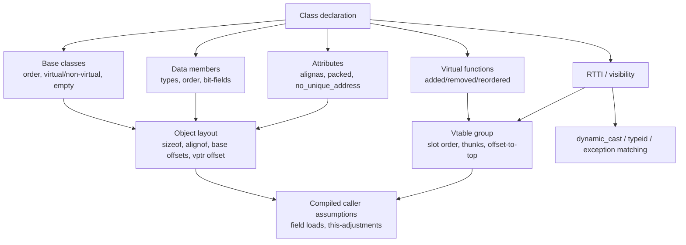

# Class Layout ABI & API: Problems and Detection

This guide is the single place that explains **what a C++ class-layout change
really is**, why some layout changes break the binary contract (ABI) while
others break only the source contract (API), and **exactly how abicheck detects
each one** — which `ChangeKind` it emits, from which evidence, and which
worked example demonstrates it.

It complements two neighbouring pages:

- [Type Layout](abi-series/03-type-layout.md) and [C++ ABI](abi-series/04-cpp-abi.md)
  — the tutorial walk-throughs.
- [Change Kinds](../reference/change-kinds.md) — the exhaustive catalog.
- [Evidence & Detectability](evidence-and-detectability.md) — the L0–L4 model.

---

## ABI vs API, and where "layout" sits

- **API** is the *source* contract: declarations, overload sets, access control,
  default arguments, templates, inline bodies, constants. Breaking it means a
  consumer must change or fix their *source* — recompilation is required, even
  if some already-built binaries keep running. abicheck classifies these as
  **`API_BREAK`** (`api_break: true`).
- **ABI** is the *compiled* contract: object size and alignment,
  base-subobject offsets, vptr placement, vtable slot order, calling
  convention, mangled names, RTTI representation, symbol visibility. Breaking it
  means an **already-compiled** consumer is now wrong — it reads the wrong
  bytes, dispatches the wrong virtual slot, or adjusts a `this`-pointer by the
  wrong amount. abicheck classifies these as **`BREAKING`** (`abi_break: true`).

A **class layout change is any change that alters a fact a compiled consumer may
already have baked in about a class object.** Under the
[Itanium C++ ABI](https://itanium-cxx-abi.github.io/cxx-abi/abi.html#class-types)
object layout is defined by object size, alignment, and the offset of every
component, built from primary-base choice, base allocation, member allocation,
bit-field rules, empty-base/`[[no_unique_address]]` placement, and virtual-base
allocation. So "layout" is much broader than "member order" — it includes:

- **base-subobject placement** (including empty-base optimization, *EBO*),
- **vptr placement** (whether the class is polymorphic at all),
- **padding / `data size` (`dsize`)** and tail-padding reuse,
- **alignment and packing**,
- **standard-layout / trivially-copyable** eligibility (which control
  `offsetof`/C-interop and the by-value calling convention),
- **potentially-overlapping subobjects** (`[[no_unique_address]]`).



---

## The class-layout change catalog (mapped to abicheck)

Every row below names the **actual `ChangeKind`(s) abicheck emits** (not generic
labels), the evidence tier that first reveals it, and a worked example case. The
verdict bucket follows the [policy partition](../reference/change-kinds.md):
`BREAKING`, `API_BREAK`, or `COMPATIBLE_WITH_RISK`.

| Scenario | Verdict | abicheck `ChangeKind`(s) | First evidence tier | Example |
|----------|---------|--------------------------|:------------------:|---------|
| Add / remove / reorder a non-static data member | BREAKING | `type_field_added` / `type_field_removed` / `type_field_offset_changed`, `struct_field_*` | L1 (DWARF) / L2 (headers) | [case40](../examples/case40_field_layout.md), [case07](../examples/case07_struct_layout.md) |
| Grow a class (private member added, embedded type grew) | BREAKING | `type_size_changed`, `struct_size_changed` | L1 | [case14](../examples/case14_cpp_class_size.md), [case127](../examples/case127_data_object_size_changed.md) |
| Change a member's type or bit-field width | BREAKING | `type_field_type_changed`, `field_bitfield_changed` | L1 | [case41](../examples/case41_type_changes.md), [case63](../examples/case63_bitfield_changed.md) |
| Change alignment or packing | BREAKING | `type_alignment_changed`, `struct_packing_changed` | L1 | [case42](../examples/case42_type_alignment_changed.md), [case56](../examples/case56_struct_packing_changed.md) |
| Reorder bases / insert a base / change virtual inheritance | BREAKING | `type_base_changed`, `base_class_position_changed`, `base_class_virtual_changed` | L1 | [case37](../examples/case37_base_class.md), [case60](../examples/case60_base_class_position_changed.md) |
| **A base subobject *moves* (e.g. EBO lost)** | BREAKING | **`base_class_offset_changed`** | L1 | **[case140](../examples/case140_empty_base_optimization_lost.md)** |
| Non-polymorphic class gains its first virtual → vptr prepended | BREAKING | `vptr_introduced` | L2 *(descriptor)* | unit-tested (`test_diff_layout.py`) |
| Add / remove / reorder a virtual function | BREAKING | `virtual_method_added`, `func_virtual_added`/`func_virtual_removed`, `type_vtable_changed` | L1 | [case38](../examples/case38_virtual_methods.md), [case68](../examples/case68_virtual_method_added.md) |
| **Vtable slot count changes — from a *stripped* binary** | BREAKING | **`vtable_slot_count_changed`** | **L0 (ELF symbol size)** | **[case141](../examples/case142_vtable_slot_count_binary_only.md)** |
| Inheritance *shape* changes — from a stripped binary | BREAKING | `rtti_inheritance_changed` | L0 (`_ZTI` size) | unit-tested (`test_diff_elf_layout.py`) |
| Type stops being trivially-copyable → by-value calling conv. flips | BREAKING | `trivially_copyable_lost`, `value_abi_trait_changed` | L2 *(descriptor)* / L1 | [case69](../examples/case69_trivial_to_nontrivial.md) |
| Type stops being standard-layout (`offsetof`/C-interop lost) | COMPATIBLE_WITH_RISK | `standard_layout_lost` | L2 *(descriptor)* | unit-tested (`test_diff_layout.py`) |
| `dsize` changes at stable `sizeof` (tail-padding reuse) | COMPATIBLE_WITH_RISK | `tail_padding_reuse_changed` | L2 *(descriptor)* | unit-tested (`test_diff_layout.py`) |
| Change a field's / method's access specifier | API_BREAK | `field_access_changed`, `method_access_changed` | L2 (headers) | [case34](../examples/case34_access_level.md) |
| RTTI / vtable visibility changes across DSOs | BREAKING | `type_visibility_changed` | L1 (DWARF attrs) | — |
| `[[no_unique_address]]` overlap gained/lost | BREAKING | *(no dedicated kind — see below)* `type_size_changed` / `type_field_offset_changed` | L1 | [case117](../examples/case117_no_unique_address.md) |
| Class gained `final` (consumers can no longer derive) | API_BREAK | `type_became_final` | L2 (headers) | [case125](../examples/case125_class_became_final.md) |

> **Why some rows say "L2 *(descriptor)*".** The fine-grained traits
> `is_standard_layout`, `is_trivially_copyable`, `vptr_offset_bits` and
> `data_size_bits` are only populated by the **header/AST (castxml)** dump path.
> DWARF gives abicheck `base_offsets` (so `base_class_offset_changed` works at
> L1) and `sizeof`/offsets, but not those C++-semantic flags. Feed headers to
> reach them. This is why the evidence you provide changes what abicheck can
> prove — see [Evidence & Detectability](evidence-and-detectability.md).

---

## How abicheck reads layout: the three detector tiers

### 1. Coarse type/struct diff — `diff_types.py`, `diff_platform.py` (L1/L2)

Compares `sizeof`, `alignof`, the field list (name, type, offset, bit-field
width), the base list, and the vtable list between the two snapshots. This is
the workhorse for the common breaks: `type_size_changed`,
`type_field_offset_changed`, `type_field_type_changed`, `type_base_changed`,
`type_vtable_changed`, `struct_packing_changed`, `type_alignment_changed`.

### 2. Fine-grained layout descriptor — `diff_layout.py` (L1/L2)

A class has moving parts the coarse `sizeof` diff under-represents. The
`RecordType` model carries an optional **layout descriptor**:

| Field | Meaning | Populated by |
|-------|---------|--------------|
| `base_offsets` | each base subobject's bit offset | DWARF + headers |
| `vptr_offset_bits` | vtable-pointer offset (polymorphism witness) | headers |
| `data_size_bits` | `dsize` — bytes the members occupy, excl. tail padding | headers |
| `is_standard_layout` | standard-layout trait | headers |
| `is_trivially_copyable` | trivially-copyable trait | headers |

From these `diff_layout.py` emits `base_class_offset_changed` (a base moved),
`vptr_introduced` (became polymorphic), `trivially_copyable_lost`,
`standard_layout_lost`, and `tail_padding_reuse_changed`.

Every comparison is **tri-state guarded**: it fires only when *both* sides carry
the relevant evidence. An evidence-tier downgrade (a DWARF-only or symbols-only
dump, or an older snapshot whose schema predates these fields) therefore never
*fabricates* a finding. When one side has a populated descriptor and the other
has no layout evidence at all, abicheck emits the calm, non-escalating
`layout_unverifiable` instead of guessing.

### 3. Binary-only C++ layout — `diff_elf_layout.py` (L0)

The most important closing of the symbol-only blind spot. The Itanium ABI fixes
the on-disk size of two emitted objects for every polymorphic class, and both
encode layout facts otherwise visible only in DWARF:

- **`_ZTV<type>`** (the vtable): laid out as
  `[offset-to-top, typeinfo*, slot0, slot1, …]`. Its `st_size` grows or shrinks
  by one pointer for every virtual added/removed/reordered ⇒
  **`vtable_slot_count_changed`**.
- **`_ZTI<type>`** (the typeinfo): its concrete runtime class
  (`__class_type_info` / `__si_class_type_info` / `__vmi_class_type_info`)
  encodes the inheritance shape, so a base-class change resizes it ⇒
  **`rtti_inheritance_changed`**.

This means a virtual-method change or a base-class change is observable from
`.dynsym` **alone** — no debug info, no headers — which is exactly what
[case141](../examples/case142_vtable_slot_count_binary_only.md) demonstrates on
a stripped `.so`. Because the slot count is *inferred* from size, these findings
are labelled `MEDIUM` confidence.

---

## What is intrinsically hard or out of scope

- **`[[no_unique_address]]` has no dedicated `ChangeKind` — by design.** When an
  empty member gains the attribute and the compiler overlays it with the next
  member, the only observable effect on the object schema is a *size or offset
  change*, which the existing `type_size_changed` / `type_field_offset_changed`
  kinds already report. [case117](../examples/case117_no_unique_address.md)
  encodes exactly this. (Note: on MSVC targets Clang ignores
  `[[no_unique_address]]` in favour of `[[msvc::no_unique_address]]`, and MSVC
  offers no ABI-stability guarantee for it.)
- **The descriptor traits need headers.** Without the castxml header path,
  `standard_layout_lost`, `trivially_copyable_lost`, `vptr_introduced`, and
  `tail_padding_reuse_changed` cannot be proven (their inputs are `None`), so
  abicheck stays silent rather than guessing. This is a property of the
  *evidence*, not a detector bug — see [Limitations](limitations.md).
- **Source-only contract changes leave no object trace.** Default-argument,
  inline-body, and uninstantiated-template changes are API events that only
  source replay (L4) can see; binary/DWARF comparison correctly reports
  `NO_CHANGE`.

---

## Platform notes

| Platform / compiler | Dominant C++ ABI rules | Layout traps that bite first |
|---------------------|------------------------|------------------------------|
| Linux x86-64, GCC/Clang | Itanium C++ ABI + ELF + SysV AMD64 | Layout drift, vtable slot changes, RTTI/visibility, libstdc++ dual ABI. **Use Linux as the canonical gate** (richest validation). |
| Windows x64, MSVC | MS x64 calling conv., decorated names, `/Zp`/`#pragma pack`, `/GR`, `/EH` | Decorated-name drift, packing, cross-DLL concrete C++ types. PDB layout cross-check is supported but non-blocking in places. |
| Windows x64, Clang-cl | MSVC-compat target (work-in-progress in corners) | "Mostly works" assumptions around member-pointer / `[[no_unique_address]]` / vtordisp edge cases. |
| Linux AArch64, GCC/Clang | Arm `cppabi64` + generic C++ ABI + AAPCS64 | Same layout/vtable risks as x86-64, plus PCS-sensitive calling convention. |
| 32-bit Arm | AAPCS32 + alternate member-function-pointer rules (Thumb bit) | Member-pointer assumptions and EH interop. |

Symbol versioning and dynamic linking do **not** abstract away layout: GNU
`ld`'s `VERSION` script and the PLT/GOT can redirect a *function symbol*, but an
old caller compiled with a stale field offset or vtable index carries that
assumption *inside its own code*. Layout and dispatch breaks live in the
consumer, where versioning cannot reach.

---

## Recommended workflow

Feed abicheck **old lib + new lib + matching public headers + debug info** so it
can reach every tier above:

```bash
abicheck compare old.so new.so \
  --old-header include/v1/foo.h \
  --new-header include/v2/foo.h \
  --policy strict_abi \
  --format sarif -o abi.sarif
```

- A stripped binary with no headers collapses toward symbol-only checking — you
  still get the L0 `vtable_slot_count_changed` / `rtti_inheritance_changed`
  signals, but the descriptor traits go dark.
- With headers + DWARF you get the full class-layout picture.
- Treat **adding a field to an empty/tag base**, **inserting or reordering a
  virtual**, and **toolchain/language-mode upgrades** (`-fabi-version`,
  `char8_t`, `noexcept`-typing, dual ABI) as ABI-review events, not routine
  edits.

See [Designing for Stability](abi-series/07-designing-for-stability.md) for the
mitigation patterns (opaque handles / pimpl, frozen inheritance, versioned
interfaces) that make most of this catalog impossible to hit.
