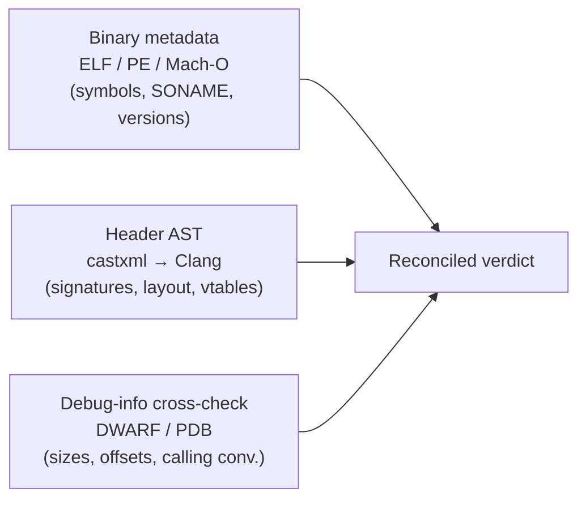
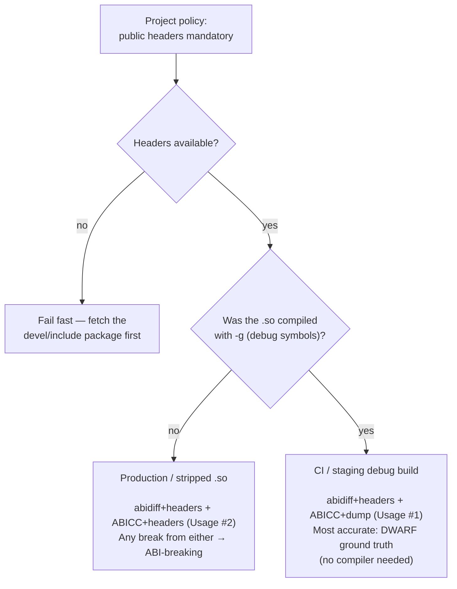
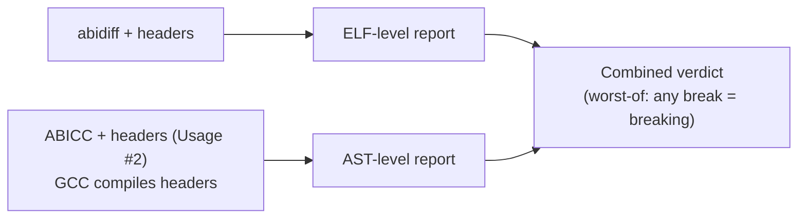

# ABI Tool Modes Reference

This document explains the analysis modes relevant to `abicheck`: **abicheck's
own native mode** (what you get by default — which itself adapts to the
[evidence sources](../concepts/evidence-and-detectability.md#0-the-five-sources-of-information)
you give it) plus the three external reference modes (`abidiff` and the two
ABICC usages) that abicheck is benchmarked against and can emulate. The
external-tool names match ABICC's official documentation.

> **Looking for what each *data source* gives you** (just the binary, debug
> symbols, headers, build data, sources) rather than what each *tool* does? That
> is the [five-source / L0–L4 model](../concepts/evidence-and-detectability.md#0-the-five-sources-of-information);
> the [next section](#abicheck-native-modes-by-evidence-source-l0l4) maps it onto
> the abicheck commands you actually run.

---

## Mode Overview

| Mode | What it is | Compiler needed? | Debug info needed? | Headers needed? |
|------|------------|:----------------:|:------------------:|:---------------:|
| **abicheck (native, default)** | abicheck's own pipeline, which adapts to the evidence you give it: binary metadata (L0) + DWARF/PDB layout (L1) + header AST via castxml (L2), optionally + build context (L3) / source replay (L4) — see [modes by source](#abicheck-native-modes-by-evidence-source-l0l4) | ⚠️ for headers only (castxml; GCC/Clang/MSVC) | optional (improves accuracy) | recommended (falls back to symbols-only) |
| abidiff + headers | `abidiff` (libabigail) | ❌ | optional (improves accuracy) | ✅ always |
| ABICC+headers (ABICC Usage #2) | Original / headers mode | ✅ **GCC only** | ❌ | ✅ |
| ABICC+dump (ABICC Usage #1) | abi-dumper / binary mode | ❌ | ✅ (`-g -Og`) | ❌ (optional) |

> The default mode is **abicheck native** — you do not need `abidiff` or
> `abi-compliance-checker` installed. The external modes are documented here
> because abicheck reports parity against them ([Tool Comparison](../reference/tool-comparison.md))
> and ships an ABICC-compatible CLI ([Migrating from ABICC](from-abicc.md)).

---

## abicheck (native layered analysis)

### Overview

By default `abicheck` does **not** shell out to any external ABI tool. It runs
its own independent analysis layers — binary metadata (L0), debug-info layout
(L1), and header AST (L2), optionally enriched with build (L3) and source (L4)
evidence — and reconciles them into a single verdict. This is the mode behind
`abicheck compare`, `abicheck dump`, and the [GitHub Action](github-action.md).
See [modes by evidence source](#abicheck-native-modes-by-evidence-source-l0l4)
for what each one provides.

### How it works



See [Architecture](../concepts/architecture.md) for the full per-layer breakdown.

### Requirements

| Requirement | Mandatory? | Notes |
|-------------|-----------|-------|
| Two inputs (`.so`/`.dll`/`.dylib`, JSON snapshot, package, or directory) | ✅ | Core input; mix freely |
| `castxml` + a compiler | ⚠️ for header AST | Needed only when you pass `-H`/`--*-header`. GCC, Clang, or MSVC — castxml emulates whichever you point it at |
| Debug info (`-g`) | ❌ optional | DWARF/PDB enrich layout, calling-convention, and packing checks |
| Headers | strongly recommended | Without them abicheck runs **symbols-only mode** and warns; type/signature breaks may be missed |

### What it catches

abicheck is a superset of the external modes for most categories — see the
[quick-reference table](#tool-comparison-quick-reference) below and the
[245-kind Change Kind Reference](../reference/change-kinds.md). Highlights the
single external tools miss:

- ✅ `noexcept`, `const`/`static` qualifier, and access-level changes (header AST)
- ✅ Calling-convention, `#pragma pack`, and alignment drift (DWARF/PDB)
- ✅ ELF/PE/Mach-O symbol-table changes (visibility, binding, versioning)
- ✅ Trivially-copyable → non-trivial calling-convention flips (DWARF traits)
- ✅ Cross-platform: ELF, PE/COFF, and Mach-O from one tool

### Usage

```bash
# Header-aware (recommended; needs castxml)
abicheck compare libv1.so libv2.so --old-header v1.h --new-header v2.h

# Binary-only fallback (no castxml required)
abicheck compare libv1.so libv2.so
```

Full flag reference: [CLI Usage](cli-usage.md).

---

## abicheck native modes by evidence source (L0–L4)

The "native mode" above is not one fixed mode — it **adapts to the evidence you
give it**. Each additional source (the five of the
[L0–L4 model](../concepts/evidence-and-detectability.md#0-the-five-sources-of-information))
switches on more detectors. Run `abicheck dump <lib> --show-data-sources` to see
exactly which sources a binary affords and which mode abicheck will use.

| Mode | You provide | `--show-data-sources` label | What data you get | Detectors | How you use it |
|------|-------------|-----------------------------|-------------------|:---------:|----------------|
| **L0 — symbols-only** | a stripped `.so`/`.dll`, no `-H` | *Symbols-only mode* | Exported symbols, SONAME/install-name, symbol versions, visibility, binding, `DT_NEEDED` deps | ~6 / 30 | Fast gate on production/stripped artifacts — catches removed/added/renamed symbols, SONAME and versioning regressions. Cannot see layout or source API. |
| **L1 — + debug info** | a `-g` build (DWARF/PDB), no `-H` | *DWARF-only mode* | L0 **plus** type layout: sizes, field offsets, enum values, vtable slots, calling convention, packing, recorded build flags | ~24 / 30 | The accurate no-headers path: `abicheck compare v1.so v2.so` on debug builds. Catches struct/enum/vtable/calling-convention breaks. Add `--dwarf-only` to force it even when headers exist. |
| **L2 — + public headers** | `-g` build **and** `-H include/` (needs castxml) | *Full (AST + DWARF)* | L1 **plus** source API: signatures, overloads, access, `final`/`explicit`/`noexcept`, templates, public/internal scoping | 30 / 30 | The recommended default: `abicheck compare … -H include/`. Catches source-only API breaks **and** scopes out internal types to avoid false positives. |
| **L3 — + build data** | L2 **plus** `-p build/` (a `compile_commands.json`) | *Full + build context* | L2 **plus** the exact ABI-relevant flags/toolchain the lib was built with | 30 / 30 + build | `abicheck dump … -H include/ -p build/`. Confirms headers were parsed with the real build flags (suppresses `header_parse_context_drift`) and flags toolchain/flag drift on stripped binaries. |
| **L4 — + sources** | a build/source pack (`--build-info pack/`) | *Full + source replay* | L3 **plus** macro/`constexpr` values, default-argument values, inline/template bodies | 30 / 30 + source | Catch the source-only facts no artifact carries. Opt-in, post-build; see [Build & Source Packs](../concepts/build-source-data.md). |

**Reading the modes.** Going down the table only ever *adds* — each mode is a
superset of the one above, both finding more breaks and (from L2) removing false
positives by scoping to the public surface. The
[`--evidence-tiers` benchmark](../reference/tool-comparison.md#benchmarking-by-evidence-tier)
quantifies the cumulative gain across the example catalog (32% → 81% → 99% →
100%). The [authority rule](../concepts/architecture.md#evidence-layers-the-five-sources)
keeps the modes honest: only L0/L1/L2 can declare a binary `BREAKING`; L3/L4
explain, scope, and add their own source-/API-level findings.

> **Quick decision.** Stripped production binary → **L0**. Debug build, no
> headers handy → **L1**. Have the public headers → **L2** (do this whenever you
> can). Reproducible build tree → add **L3**. Need macro/default-arg/inline
> guarantees → **L4**.

---

## Decision Flowchart

This flowchart applies when you replicate the analysis with the **external
reference tools**. With abicheck native, you simply pass headers (and `-g`
binaries when available) and abicheck picks the strongest layers automatically.



> **Production default:** abidiff+headers + ABICC+headers (ABICC Usage #2).
> Production `.so` files have no debug info → Usage #1 unavailable.

---

## abidiff + headers (libabigail)

### Overview

`abidiff` from **libabigail** compares two `.so` files using their ELF symbol tables
and optionally DWARF debug sections. **We always pass headers** via `--headers-dir`
to improve type resolution.

### How it works

```
libv1.so ──► abidw --headers-dir include/ ──► v1.xml ──┐
                                                         ├──► abidiff ──► report
libv2.so ──► abidw --headers-dir include/ ──► v2.xml ──┘
```

### Requirements

| Requirement | Mandatory? | Notes |
|-------------|-----------|-------|
| Two `.so` files | ✅ | Core input |
| Headers (`--headers-dir`) | ✅ our policy | Greatly improves type resolution |
| DWARF debug info (`-g`) | ❌ optional | Provides additional type layout info |
| Compiler | ❌ | Not needed |

### What it catches

- ✅ Symbol removal/addition
- ✅ Type layout changes (struct/class field changes) — with DWARF or headers
- ✅ vtable changes — with DWARF
- ✅ Return type, parameter type changes — with DWARF/headers
- ✅ Enum value changes
- ✅ ELF-only symbol changes (visibility, binding)

### What it misses

- ❌ `noexcept` specifier (not in DWARF or ELF)
- ❌ `inline` → non-inline ODR changes (inline functions absent from `.so`)
- ❌ C++ `[[nodiscard]]`, `[[deprecated]]`, `explicit` attribute changes
- ❌ Template instantiation details without DWARF
- ❌ Dependency ABI leaks (transitive header type changes) without DWARF

### Usage

```bash
sudo apt-get install abigail-tools

abidw --headers-dir include/ --out-file v1.xml libv1.so
abidw --headers-dir include/ --out-file v2.xml libv2.so
abidiff v1.xml v2.xml
```

### Exit codes

| Code | Meaning |
|------|---------|
| 0 | No ABI change |
| 4 | ABI change (type/layout diff or compatible addition) |
| 12 | Breaking change (symbol removed) |

---

## ABICC+headers (ABICC Usage #2 — Original / Headers Mode)

> This is what `abi-compliance-checker` calls **USAGE #2 (ORIGINAL)** in its docs.

### Overview

ABICC receives an XML descriptor pointing to the `.so` and headers directory. It uses
**GCC** to compile the headers, extract the full C++ AST, compute type layouts, and
build an ABI dump. Then it compares two such dumps.

### How it works

```
OLD.xml (headers + .so) ──► abi-compliance-checker ──► ABI-old.dump ──┐
                                 (compiles via GCC)                     ├──► report
NEW.xml (headers + .so) ──► abi-compliance-checker ──► ABI-new.dump ──┘
```

### Requirements

| Requirement | Mandatory? | Notes |
|-------------|-----------|-------|
| Two `.so` files | ✅ | |
| Headers | ✅ | The main input for ABI description |
| `abi-compliance-checker` | ✅ | |
| **GCC** | ✅ **GCC only** | ABICC calls GCC internally to compile headers. Proprietary compilers (`icpx`/`icc`) and Clang are **not supported**. |
| DWARF debug info | ❌ | Not needed — headers provide type information |

> **Note:** GCC must be installed even if the library itself is built
> with a different compiler (e.g. `icpx`). ABICC only uses GCC to parse headers, not to compile the library.

### What it catches (beyond abidiff)

- ✅ Everything abidiff catches (with headers as source)
- ✅ `noexcept` specifier changes
- ✅ `inline` → non-inline ODR (symbol absent from v1 .so, appears in v2)
- ✅ C++ attribute changes (`[[nodiscard]]`, `explicit`, etc.)
- ✅ Template instantiation ABI via AST
- ✅ Dependency ABI leaks (if transitive headers are included)
- ✅ Works on stripped production `.so` (no `-g` needed)

### What it misses

- ❌ ELF-only symbol visibility changes (no symbol table analysis)
- ❌ Anonymous struct/union not expressible in headers
- ❌ Types resolved differently by `#ifdef`/macro guards at compile time (header AST may differ from actual compiled result)

### Usage

```bash
sudo apt-get install abi-compliance-checker gcc

# Create OLD.xml descriptor:
cat > OLD.xml << EOF
<version>1.0</version>
<headers>/path/to/v1/include/</headers>
<libs>/path/to/libfoo_v1.so</libs>
EOF

# Create NEW.xml similarly, then compare:
abi-compliance-checker -lib libfoo -old OLD.xml -new NEW.xml
```

---

## ABICC+dump (ABICC Usage #1 — abi-dumper / Binary Mode)

> This is what `abi-compliance-checker` calls **USAGE #1 (WITH ABI DUMPER)** in its docs.

### Overview

`abi-dumper` reads DWARF debug sections directly from the `.so` binary and produces
a `.dump` file. **No compiler is involved at any step.** ABICC then compares two dumps.

### How it works

```
libv1.so (with -g) ──► abi-dumper ──► ABI-1.dump ──┐
                                                     ├──► abi-compliance-checker ──► report
libv2.so (with -g) ──► abi-dumper ──► ABI-2.dump ──┘
```

### Requirements

| Requirement | Mandatory? | Notes |
|-------------|-----------|-------|
| Two `.so` compiled with `-g -Og` | ✅ | DWARF is the input — no debug info = no dump |
| `abi-dumper` | ✅ | `sudo apt-get install abi-dumper` |
| `abi-compliance-checker` | ✅ | |
| `universal-ctags` | ✅ | Required by abi-dumper |
| `vtable-dumper` | ✅ | For C++ vtable extraction |
| Compiler | ❌ **not needed** | abi-dumper reads binary DWARF, no compilation |
| Headers | ❌ optional | `abi-dumper -public-headers include/` filters to public API |

### What it catches (beyond Usage #2)

- ✅ Anonymous struct/union layouts (in DWARF but not expressible in headers)
- ✅ Types resolved by compiler flags/macros (DWARF = actual compiled result)
- ✅ Complex typedef chains to actual underlying types
- ✅ Bit-field layouts at bit-level precision
- ✅ `#pragma pack` effects
- ✅ Types from `.cpp` implementation files leaked into ABI

### What it misses

- ❌ Inline-only (header-only) API — never compiled into `.so`, no DWARF
- ❌ `noexcept` specifier (not stored in DWARF)
- ❌ ELF-only symbol visibility changes
- ❌ Requires `-g` build — not available for production stripped binaries

### Limitations

1. **Requires debug builds** — production `.so` files are stripped. This mode
   requires CI/staging debug builds.
2. **No compiler required, but debug info required** — the `.so` must be compiled
   with `-g -Og`. The compiler used (GCC, icpx, clang) does not matter for this mode —
   abi-dumper reads DWARF directly.

### Usage

```bash
sudo apt-get install abi-dumper abi-compliance-checker universal-ctags vtable-dumper

# Build with debug info (any compiler: gcc, icpx, clang)
g++ -shared -fPIC -g -Og -o libfoo_v1.so src_v1.cpp

abi-dumper libfoo_v1.so -o ABI-1.dump -lver 1.0 -public-headers include/
abi-dumper libfoo_v2.so -o ABI-2.dump -lver 2.0 -public-headers include/
abi-compliance-checker -lib libfoo -old ABI-1.dump -new ABI-2.dump
```

---

## Reference parity combination

abicheck's **native** mode (above) is the production default and needs no
external tools. When you instead want to replicate the analysis with the
external reference tools — for parity benchmarking or in an ABICC-only
environment — the recommended combination is **abidiff+headers + ABICC+headers
(ABICC Usage #2)**, taking the worst-of verdict:



**Why not Usage #1 by default:**
- Production `.so` files are stripped (no `-g`) — abi-dumper cannot read DWARF
- Usage #2 works on production binaries and catches the C++ semantic cases (noexcept,
  templates, ODR) that abidiff misses
- Usage #1 is available as an optional mode when CI/staging provides debug builds

**Why two tools combined:**
- abidiff catches ELF-only symbol changes that ABICC+headers (ABICC Usage #2) misses
- ABICC+headers (ABICC Usage #2) catches noexcept/template/ODR that abidiff misses
- Together they cover the full ABI contract

---

## Tool Comparison Quick Reference

| ABI break type | abicheck (native) | abidiff+headers | ABICC+headers (ABICC Usage #2) | ABICC+dump (ABICC Usage #1) |
|---|:---:|:---:|:---:|:---:|
| Symbol removed | ✅ | ✅ | ✅ | ✅ |
| Symbol added | ✅ | ✅ | ✅ | ✅ |
| Param type change | ✅ | ✅ | ✅ | ✅ |
| Struct layout change | ✅ | ⚠️ DWARF | ✅ | ✅ |
| vtable change | ✅ | ⚠️ DWARF | ✅ | ✅ |
| `noexcept` removed | ✅ | ❌ | ✅ | ❌ |
| `inline` → non-inline | ✅ | ❌ | ✅ | ❌ |
| Template ABI | ✅ | ⚠️ DWARF | ✅ | ✅ |
| Dependency leak | ⚠️ DWARF | ⚠️ DWARF | ✅ | ✅ |
| Anonymous types | ⚠️ DWARF | ❌ | ❌ | ✅ |
| Macro-resolved types | ⚠️ DWARF | ❌ | ❌ | ✅ |
| ELF/PE/Mach-O visibility | ✅ | ✅ | ❌ | ❌ |
| Calling-convention drift | ✅ | ❌ | ❌ | ⚠️ DWARF |
| Cross-platform (PE, Mach-O) | ✅ | ❌ | ❌ | ❌ |
| Needs compiler | ⚠️ headers only | ❌ | ✅ GCC | ❌ |
| Needs debug build | ❌ | ❌ | ❌ | ✅ |
